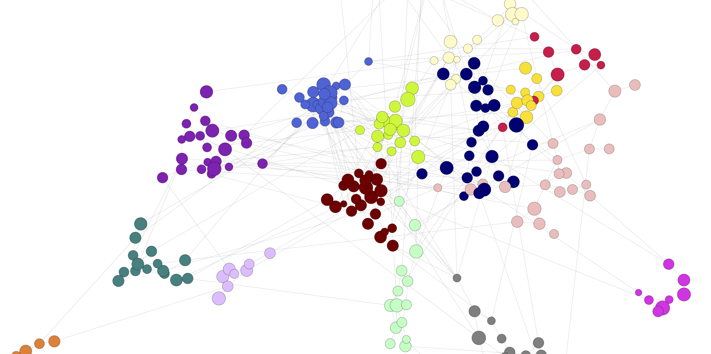

```{js, echo=FALSE}
$("#rStudioHeader").removeClass("alwaysShrunk");
$("#pageContent").removeClass("standardPadding");
```


<!--html_preserve-->

<div id="homeContent">
  <div class="band full blue first rightText">
    <div class="bandContent vCenter">
      <div class="blurb">
        <div class="tagline">Ecology. Complex Networks. R.</div>
        <div>What is an ecological community? What are ecological networks? How can they be analysed? Ask ecologically meaningful questions and answer them using complex networks tools. Have fun in the process.</div>
      </div>
    </div>
    
  </div>

  <div class="band full gray1 second leftText">
    <div class="bandContent vCenter">
      <div class="blurb">
        <div>Use the latest libraries for network analyses in R. Discover easy and interesting ways to analyse networks, and produce high quality pictures to present your results.
          <br> 
          <br>
          <a href="lesson-1.html"><button class="bigButton getStarted">Get Started</button></a>
          <a href="gallery.html"><button class="bigButton gallery">Resources</button></a>
        </div>
      </div>
    </div>
    
  </div>


</div>

<!--/html_preserve-->
