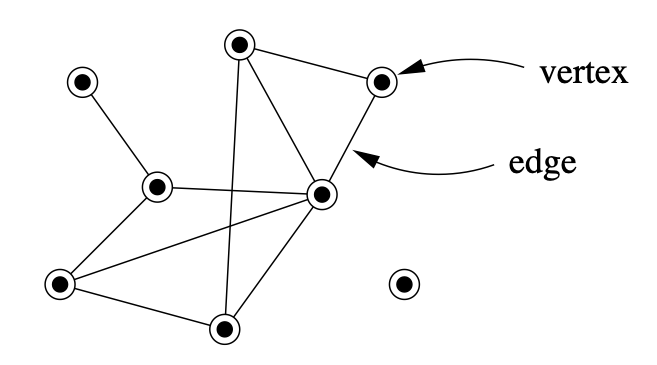
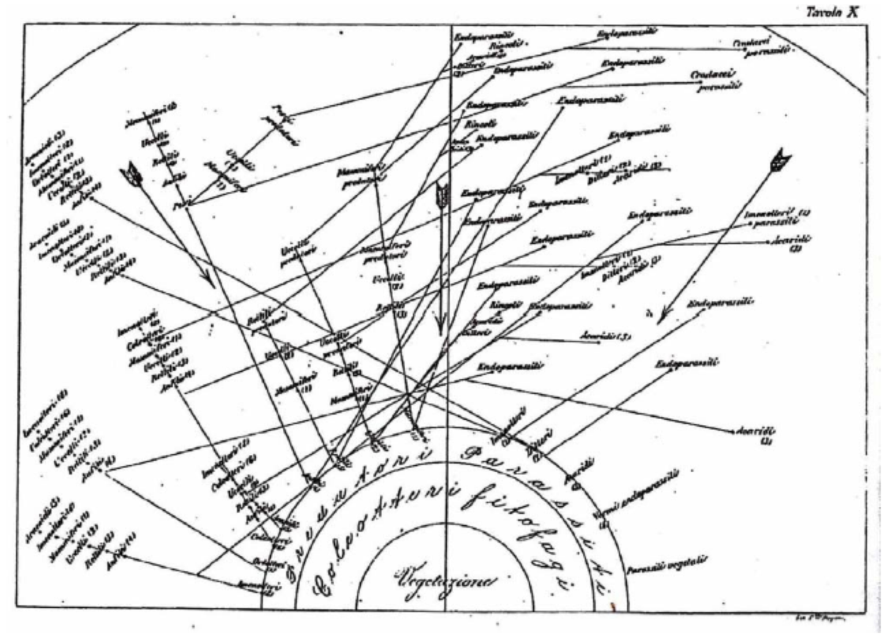
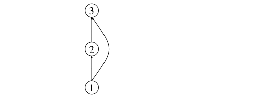

## What is a network?

A network (or graph in mathematics) is a set of elements with specific characteristic relationships between them. We call the elements vertices (or nodes) and the relations between them edges (or links). In the picture below we can see a network composed of 8 nodes and 10 links between them. 

<center>
{width=50%}
</center>

There are a couple of things to be noted about this network, which we will revisit later on. The links between the nodes do not have an apparent directionality, making this an **undirected graph**. On the other hand, when the direction between link is relevant, such as for example in a predator-prey interaction, where it is convenient to represent the fact that the flow of biomass runs from prey to predator, the links might be represented as arrows. Networks represented in this way are called **directed graphs**.

Secondly, one of the nodes is *isolated*. Can you guess which one it is?

Many systems both natural and man-made, can be thought of as networks. From the network of airports around to world and the air routes connecting them, to the World Wide Web and the links between web pages, or social networks of friendships (both real and digital), all the way down to microscopic entities such as gene and metabolic networks, these systems can be represented and, perhaps more importantly, analysed as networks.

{width="280px" style="float:left; padding-right:10px"}

The mathematical study of graphs (or networks) arguably started in 1735 when the celebrated mathematician [Leonhard Euler](https://en.wikipedia.org/wiki/Leonhard_Euler), yes!, the same one who introduced the *e* as the base of the natural logarithm, developed what is considered the first theorem of graph theory to solve the problem known as the [Seven bridges of Königsberg](https://en.wikipedia.org/wiki/Seven_Bridges_of_K%C3%B6nigsberg).


{width="380px" style="padding-left:100px"}
Ever since then, the application of graph theory has percolated the sciences. It started back in the 1930s when tools for the analysis of networks were applied to the social sciences to develop a better understanding of social relationships among humans.

In ecology, even though network representations of natural communities can be traced back to the 1880's in the work by Lorenzo Camerano, the quantitative analysis of networks and their properties, as well as their mathematical modelling, started much more recently, around the 1960's - 70's.

<center>
{width="380px"}
</center>

In the following sections we will learn how to analyse networks. Our focus will be networks of ecological interactions between species sharing the same ecological community. In very diverse systems these can be up to 1,000's of species. As such, many of the quantities we will be learning about are mostly relevant to quantify **biodiversity** and can be seen as a natural extension to the classical analysis performed in **community ecology**. Nonetheless, the underlying principles of network construction and analysis can be applied to any networked system, including those mentioned above.

## Network formats: edgelists and adjacency matrices

To be able to manipulate and analyse networks in an automated way, we need to represent them in a way that is understandable by a computer.

Several computer readable formats exist to store the description and information contained in a network. The most commonly used in ecology (and other disciplines) are: (i) adjacency matrices, and (ii) edgelists.

Adjancecy matrices are matrices in which columns and rows represent the nodes (species) in the network, and a link (interaction) between them is repsented as a 1, while the absence of a link is represented as a 0.

In a foodweb, for example, as we saw previously, links are directed from prey to predator. In the adjacency matrix, the rows represent prey species and the columns represent predators. Thus, an interaction a<sub>ij</sub> runs from prey i to predator j.

In the case of a mutualistic (i.e. bipartite) network, species are not all represented in each dimension of the matrix (rows and columns). Instead hosts are usually shown in rows and their mutualistic partners are shown in columns. This makes these matrices non-square.

Edge lists, on the other hand, are lists of pairs of identifiers (usually integers) that denote links (or ecological interactions) from the first item in pair to the second. For example, a network specified by the following edgelist: 

1 2 <br>
2 3 <br>
1 3 <br>

is one with three nodes: V = {1,2,3}, and three links: one from basal prey 1 to primary consumer 2, another one from prey (primary consumer) 2 to top predator 3, and finally, an interaction between the basal resource and the top predator (E = {(1,2), (2,3), (1,3)}). This makes the top predator an omnivorous species. A representation of this network is shown below:



This network can be represented as an adjacency matrix thus:


More sophisticated ways of representing and storing networks exist, such as for example the [GraphML](http://graphml.graphdrawing.org) format, in which additional information about the network, the nodes, and the links can be included in the description.

In this course, we will use edge lists as a starting format and then convert that representation into an adjacency matrix.

Throughout the course we will use a few examples of real ecological networks taken publicly available databases such as the well-known food web from the Benguela upwelling marine system off the Western coast of Africa:


{height=500px}

Image taken from Yodzis, P (1998) *Local trophodynamics and the interaction of marine mammals and fisheries in the Benguela ecosystem*. **Journal of Animal Ecology**. 67, 635-658.

This, and other ecological networks datasets are available from the [Global Food Web Database](https://www.globalwebdb.com/).

The code below will enable you to download the edgelist file and use it to create an adjacency matrix representation of the network. Two representations of the network then remain available: the Edgelist representation (`benguela.EL`) and the Adjacency Matrix representation (`benguela.AM`).

```{r}
library(RCurl)
x <- getURL("https://raw.githubusercontent.com/mlurgi/networks_for_r/master/datasets/benguela.edgelist")
benguela.EL <- read.table(text = x) 
benguela.EL <- as.matrix(benguela.EL)
```


```{r}
# Create an adjacency matrix called benguela.AM, containing only zeros
benguela.AM <- matrix(0, max(benguela.EL), max(benguela.EL))

# Introduce ones to the matrix to represent interactions between species
benguela.AM[benguela.EL] <- 1
```


***
## [Continue to Ecological networks: Species and interactions](lesson-3.html){.continue-link}
