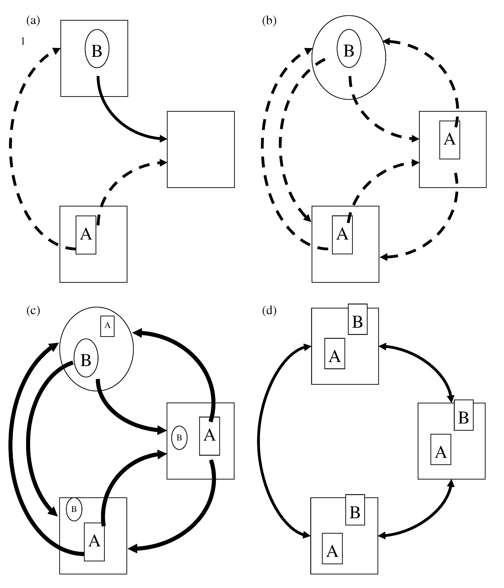

{width="200px" style="float:right; padding-left:10px"}


Ever since [Alfred Russel Wallace](https://en.wikipedia.org/wiki/Alfred_Russel_Wallace)'s pioneering expeditions to the Malay Archipelago, during which he realised the fundamental differences between neighbouring faunas and their link to the independent evolutionary dynamics that ensue after geographical isolation, ecologists have tried to understand the underlying mechanisms behind the observed geographical distributions of animal and plant species.

Wallace, now considered the father of biogeography, but also jointly with Darwin one of the original proponents of the theory of evolution by natural selection, proposed the separation between islands in the Indonesian Archipelago according to whether the animal species on those islands where from Asian or Australasian origins, in what is now known as Wallace's line.

{width="380px" style="float:left; padding-right:10px"}
The study of the spatial distribution of species has revealed recurrent patterns in the way biodiversity is organised and how it changes across spatial scales, as well as the implications of this organisation for community composition and structure. It has also prompted the development of ecological theory aimed at understanding the mechanisms behind these spatial patterns. Spatial processes thus have since then emerged as one of the fundamental drivers of biodiversity.

One of the spatial patterns of biodiversity that has attracted most attention, not only for its simplicity, but also because of its universality, is the relationship between the size of the area sampled and the number of species found within.

## 2.1- Species-Area relationships

Arguably one of the only true laws in ecology is the species-area relationship. **Species-Area Relationships (SARs)** describe the relation between area sampled and the number of species present in that area. Species-area relationships were first described by Arrhenius in 1921, who observed similar scaling relationships across plant communities. Since then, many ecologists have collected similar data of species richness across different expanses of areas. Many empirical systems have thus been shown to follow general scaling patterns and this pattern can be described by a **power law**!

<center>
{width="500px"}

</center>

**Species-area relationship showing bird species richness as a function of island size in the West Indies.** Image taken from Preston, FW (1962) *The canonical distribution of commonness and rarity: Part I*. ***Ecology***. 43:2, 185-215. 

The seminal paper by [Preston in 1962](https://www.jstor.org/stable/1931976) building upon Arrhenius work and presenting SARs like the one above for different faunas, presented canonical values for the parameters of the power law form of the SARs:

$$
S = c A^z     
$$

where *S* is species richness, *c* is a proportionality constant, *A* is the area size, and *z* is the scaling exponent of the relationship. Applying the logarithm to both sides of the equation above, we can linearize and obtain the expression:

$$
ln(S) = ln(c) + z * ln(A)
$$

Making easy to fit a straight line to the log-log relationship of species richness with area size, and the reason why most of the times we see that relationship represented as in the plot above.

The value of *z* across systems was shown by Preston, and many others after him, to be in the range of 0.1 and 0.5 and usually around the value of 0.25. The existence of this canonical value suggests profound general principles of community richness, and makes it a powerful predictive tool that has been used ever since in biodiversity conservation and studies of extinction during biotic collapse. The value of *c* and its universality is a highly debated topic in ecology (see [Lomolino's account](http://ecflora.cavehill.uwi.edu/bio_courses/ECOL2453/pdfs/species%20area%20relationship.pdf) for a nice discussion).


## 2.2- The Theory of Island Biogeography

The discovery of 'true ecological laws' such as SARs represented an important advance for the field and for our efforts to better understand biodiversity and its distribution. However, as Simon Levin ([1992](https://esajournals.onlinelibrary.wiley.com/doi/10.2307/1941447)) elegantly puts it:

***"Understanding patterns in terms of the processes that produce them is the essence of science, and is the key to the development of principles for management."***

{width="200px" style="float:right; padding-left:10px"}

In 1967, two of the most prominent ecologists, [Robert H. MacArthur](https://en.wikipedia.org/wiki/Robert_H._MacArthur) and [Edward O. Wilson](https://en.wikipedia.org/wiki/E._O._Wilson), attempted to provide a mechanistic explanation for the distributional patterns of species using a graphical and mathematical framework. This framework has become to be known as the Theory of Island Biogeography. Ever since its development, the Theory of Island Biogeography has formed the backbone of our thinking on species distributions and accumulation of species with area.

The Theory of Island Biogeography poses that the number of species at equilibrium on a given island (or isolated patch of habitat) is given by a compromise between the rates of colonisation and extinction of species. In particular:

$$
S = \frac{cS_p}{(c+e)}
$$
where *S* is the number of species on a given island, *S~p~* is the number of species in the species pool and *c* and *e* are the extinction and colonisation rates respectively. MacArthur and Wilson went on and developed a series of theoretical expectations based on the expectation that the colonisation and extinction rates on islands should vary predictably with two main aspects of their geography: 1.- their distance from the mainland (where the species pool is located), and 2.- their size.

Different configurations of distance from the mainland on the one hand, influencing colonisation ***-the closer an island is to the mainland the higher its probability of being colonised by a species-***; and area size on the other, influencing extinctions ***-the smaller an island the higher the chances a species would go extinct on it due to the limited availability of resources, habitat, etc that accompanies small areas-***, thus produce different equilibria in species richness.


<center>
{width="500px"}
</center>

<br>

The theoretical framework proposed by the Theory of Island Biogeography has been applied on several settings where species richness in relatively isolated patches depend to one extent or another on a given species pool. Examples of this include mountaintops, forest fragments, or organic particles suspended in the ocean waiting to be colonised by microorganisms.

What about if the interest is in understanding the distribution of a single species across a landscape of patches of habitat?

## 2.3- Metapopulations

In spatially explicit settings, in which several patches of suitable habitat are present, we might be interest in understanding and predicting the occupancy of a species across this landscape (i.e. the fraction of patches that a species can occupy). This exact same question was in the mind of Richard Levins in 1969 when he was trying to predict how much of a crop (habitat) would be attacked (colonised) by a given pest species (coloniser).

He realised that this problem could be formalised mathematically using a simple model that accounts for *colonisation* and *extinction* rates of the species at local ‘patches’ of suitable habitat. Levin’s thus proposed, for the first time, a metapopulation model that would lay the foundations of metapopulation theory. The model took the form of a differential equation expressing the rate of change in the fraction of patches colonised through time as a function of *colonisation* and *extinction*.

$$
\frac{dp}{dt} = cp(1-p) - ep
$$
where *p* is the fraction of patches of habitat occupied by the species, and *c* and *e* are the colonisation and extinction rates of empty and occupied patches respectively. Solving this equation to its equilibrium, i.e. by making $\frac{dp}{dt} = 0$ we obtain the equilibrium $p^* = 1 - e/c$.

Ordinary differential equations (ODEs), such as the Levins' metapopulation model, can be solved analytically (as we just did above when we found the equilibrium value $p^*$) but can also be solved numerically. Numerically solving an ODE involves a series of mathematical tricks that allow us to ***approximate*** the next value of variable of interest based on a previous value and an infinitesimally small time over which it has changed using the tools of ***calculus***. Luckily, nowadays all those mathematical complexities have conveniently been packed for us into software libraries that we can use out of the box to solve our equations. In R, one such library is called **deSolve**.

We can thus implement the Levins' metapopulation model and solve it numerically:

```{r setup, warning=FALSE, message=FALSE, out.width="60%", fig.align='center'}
# Simulating the Levins’ metapopulation model in continuous time
# import the numerical integration library
require(deSolve)

# This function implements the model
levins <- function(t, p, parameters) {
  with(as.list(c(p, parameters)), {
    dp <- c*p*(1-p) - e*p
    return(list(dp))
  }) 
}

# we define the parameters of the model: c = colonisation rate, e = extinction rate
parameters <- c(c=0.15, e=0.05)
Initial.p <- c(p=.1)
out.L <- data.frame(ode(y=Initial.p, times=1:100, func=levins, parms=parameters))

# the plotting library
require(ggplot2)

# plot the results
qplot(x=out.L[,1], y=out.L[,2], geom="line", ylab="p", xlab="time")  +
  annotate("text", 75, .3, label=expression(over(dp,dt)==cp(1-p)-ep))
```

In the example above we set the parameter values to $c=0.15$ and $e=0.05$. Using the expression for $p^*$ that we derived earlier we can calculate the exact equilibrium value for *p* and compare it to the outcome of our integration procedure. Try it out!

Using the code above, we can also perform some exhaustive explorations of the parameter space to evaluate the changes on the system's behaviour when the values for the colonisation and extinction rates are altered. This can be useful to test hypotheses and make predictions about the effects of changes on colonisation and / or extinction rates due to external forcing, like for example environmental stressors.

```{r warning=FALSE, message=FALSE, out.width="60%", fig.align='center'}
# Exploring the parameters’ space for the Levins metapopulation model
extinctions <- seq(0.01,1,length.out=30)		# range of values for e
colonisations <- seq(0.01,1,length.out=30)		# range of values for c

# we create an empty matrix to store our results
N <- matrix(0, nrow=length(extinctions), ncol=length(colonisations))

# the nested for loop to go over the e values and the c values
for(rep in 1:length(extinctions)){
  ext <- extinctions[rep]
  for(rep2 in 1:length(colonisations)){
    col <- colonisations[rep2]
    prms <- c(c=col, e=ext)
    Initial.p <- c(p=.1)
    
    # we use a larger time period to ensure equilibrium is achieved for all simulations
    out.L <- data.frame(ode(y=Initial.p, times=1:100, func=levins, parms=prms))		
    N[rep, rep2] <- out.L[100,2]
  }
} 

require(viridis)
fields::image.plot(x = colonisations, 
      z = t(N), 
      y = extinctions, 
      legend.lab = 'fraction occupied patches', col=viridis(128),
      xlab='colonisation rate', ylab='extinction rate')

```


Metapopulations are a handy way of thinking about spatially explicit populations in which local dynamics and demographic processes are more or less independent but some exchange of individuals via ***dispersal*** occurs amongst populations. The simplest models like the Levins' model above make several assumptions. For example, it is a central assumption that ***all patches have the same local conditions***, i.e. there is no spatial heterogeneity, which might be realistic for the pests invading crops that Levins was studying. That assumption however, is likely to be violated in many natural systems in which, inevitably, some patches of habitats are "better" than others. By being "better" we mean that the growth rate of the population inhabiting a better patch is higher than the growth rate in a population in a "worse" patch.

Situations like this give rise to phenomena such as ***source-sink dynamics***, in which source patches produce an excess of individuals that will then go on an disperse to other patches. If those patches receiving individuals from outside are in general bad for growth (i.e. growth rates of the populations within them are negative), they can't really be sustained unless they have a constant influx from more prosperous patches. These former patches are thus sinks. When considered at the large spatial scale (i.e. the whole set of patches together) then the metapopulation will be considered to persist, whereas if we focus on only those "worse" patches we might think that the population is doomed to collapse.

<center>
{width="500px"}
</center>

So, populations can persist regionally as a metapopulation even if some local populations might not persist for long.

Time also plays a role, with the quality of patches changing through time, making the metapopulation dynamics even more complex and harder to understand.

## 2.5- Metacommunities

To add even more complexity to this whole picture we have to remember that all of these colonisations and extinctions to and from patches by a single species does not really happen in isolation. It happens in a community context (i.e. within communities containing other species) that is very dynamic. This realisation gave rise to metacommunity theory: a framework designed to think about spatially explicit local communities of many species connected via dispersal. Pretty much like a metapopulation but involving many species that might be interacting.

<center>
{width="400px"}
</center>
<center>
**The four paradigms of metacommunity theory for two competing species.** (a) patch-dynamics, (b) species sorting, (c) mass effects, and (d) neutral . Image taken from Leibold, MA et al. ***Ecology Letters*** (2004). 
</center>

<br>

In 2004, Leibold and colleagues, proposed a way of thinking about metacommunities that revolves around a combination of 4 *metacommunity paradigms*. These metacommunity paradigms summarise the ways in which local dynamics between species and the environment interact with regional dynamics of dispersal to give rise to regional patterns of biodiversity. In the patch dynamics paradigm (a in the figure above) landscape scale persistence and coexistence is given by a trade off between colonisation and competition. In this case species A is a superior competitor but poor coloniser (shown by the dashed arrows vs the thick arrows of B), whereas species B is a good coloniser but a bad competitor, so it is not able to colonise species A's habitat (the square shaped large boxes). The species sorting paradigm (b in the figure) poses that competition is the strongest process determining species presence and as such dispersal is weak in general and all species are only found in their corresponding matching habitats (matching shapes of species and habitats). In the mass effects scenario (c), dispersal is so strong that it overrides any competitive advantage that species might have, allowing them to coexist everywhere. Finally, the neutral paradigm (d) suggests that all species are exactly the same and hence there are no real differences between communities at local scales.

This way of thinking about the multi-scale character of biodiversity and the patterns of biodiversity distribution has prompted much research into the mechanisms that give rise to biodiversity patterns across spatial scales. Theoretical frameworks like this can not only aid the understanding of community assembly but also the prediction of the potential effects of habitat loss on biodiversity.

## 2.6- Network-Area Relationships

This way of thinking has [recently allowed us to extend the ideas of SARs into multispecies communities](https://www.nature.com/articles/s41559-018-0517-3). In particular, to the way that properties related to the networks of species interactions that characterise natural communities changes across spatial scales.

Using an extension of the Theory of Island Biogeography, and a meta-community model inspired on the metacommunty paradigms introduced above, we developed a theoretical framework to understand the influence of dispersal, colonisation and extinction on the scaling of biodiversity. The full model can be found [here](https://github.com/mlurgi/network-area).

***An Island Biogeography model for food webs:*** In this model, species occupancy depends not only on colonisation and extinction rates, but also on trophic constraints enforced in which a species can only be present in the community if at least one of its prey (as defined by the food web structure) is also present. Except for basal species which can be first colonisers.

```{r, trophic-biogeography, fig.align='center', message=FALSE, warning=FALSE, out.width="60%", eval=TRUE}
source('funcs.r')
# we explore the model using a colonisation rate and several values of extinction rates
# the ratio between these values determines the equilibrium number of species
c <- .7
extinction <- c(.05, 0.07, .1, .15, .2, .3, .4, .5, .6, .7, .8, .9)

# since this is an stochastic model we perform several replicated simulations and analyse the average trend
replicates <- 5

# number of timesteps per replicate
timesteps <- 100

# in this data structure we store the output of our simulations
output <- NULL
for(e in extinction){
  for(j in 1:replicates){
    # out communities are structured according to food webs derived from the niche model and that include 200 species with a connectance of ~ 0.05
    file_name <- paste0("https://raw.githubusercontent.com/mlurgi/serrapilheira_eco_networks/master/datasets/networks/network-",j,".rda")
    con <- url(file_name) 
    load(con)
    close(con)
    S <- food_web$S
    presences <- array(0, S)
    for(i in 1:timesteps){
      #basal species
      basal_sps <- which(colSums(food_web$M) == 0)
      cur_com <- presences
      
      #this is what species are present
      present <- which(cur_com != 0)
      
      if(sum(cur_com) != 0){
        
        #this is the set of species in the network that have prey in the current community
        with_prey <- which(colSums(as.matrix(food_web$M[present, ])) > 0)
        #this are the potential colonisers
        potential <- append(basal_sps , with_prey)
        #to which we remove the ones that are already present
        potential <- setdiff(potential, present)
        
      }else{
        potential <- basal_sps
      }
      
      if(length(potential) != 0){
        colonisers <- potential[which(runif(length(potential), 0, 1) < c)]
        presences[colonisers] <- 1
      }
      
      extinctions <- FALSE
      if(length(present) != 0){
        extinct <- present[which(runif(length(present), 0, 1) < e)]
        if(length(extinct) != 0){
          presences[extinct] <- 0
          extinctions <- TRUE
        }
      }
      
      if(extinctions){
        cur_com <- presences
        #this is what species are present
        present <- which(cur_com != 0)
        #this is the set of species in the network that have prey in the current community
        with_prey <- which(colSums(as.matrix(food_web$M[present, ])) > 0)
        legal <- union(with_prey, basal_sps)
        illegal <- present[!(present %in% legal)]
        presences[illegal] <- 0  
      }
      
    }
    
    results <- presences
    net <- food_web
    
    current_species <- which(results > 0)
    
    if(length(current_species) < 2){
      next
    }
    
    M <- net$M[current_species, current_species]
    C <- sum(M)/((dim(M)[1])*(dim(M)[1]-1)) #Connectance if we prevent cannibalism
    
    links <- sum(M)
    indegree <- Generality(M)
    outdegree <- Vulnerability(M)
    basal <- FractionOfBasal(M)
    top <- FractionOfTop(M)
    intermediate <- FractionOfIntermediate(M)
    sd_gen <- SDGenerality(M)
    sd_vul <- SDVulnerability(M)
    ratio <- c/e
    
    cur_out <- data.frame(replicate=j, ratio, S=length(current_species), C, links, indegree, outdegree, basal, top, intermediate, sd_gen, sd_vul)
    
    if(is.null(output)){
      output <- cur_out
    }else{
      output <- rbind(output, cur_out)
    } 
    
  }
}

ggplot(output, aes(ratio, links)) + geom_point() + theme_bw() + xlab('c-e ratio') + ylab('number of interactions') 
```

On the x-axis we plot the ratio between colonisation and extinction as a proxy for the area sampled. Islands with bigger areas have a higher colonisation relative to extinction rates and hence higher chances of harbouring more species. On the y-axis we can plot any of the network properties calculated within the replicated simulations routine to examine how such property scales with area sampled. In the case of the figure shown above, we have chosen the number of interactions in the network (i.e. number of links). **Try plotting other properties (or add new ones into the routine) to see what you find!**

**A meta-community model.** As we saw above, another way of exploring spatial mechanisms and their influence on biodiversity patterns is by thinking of patches of suitable habitat as local communities that are connected to other patches / communities via dispersal. These dispersal corridors might cross more or less suitable habitat. Depending on the quality of these dispersal corridors (and their distance) dispersal can be more or less effective. This can be explored in simulations by varying the dispersal rates between patches.

To try to understand the effect of dispersal on metacommunities on the shape of species interaction netwworks across spatial scales, we extended the island biogeography model into a metacommunity in which each local community is represented by the network of ecological interactions happening between the species in the community (similar to the model above). These community networks are then connected to other "local" networks via dispersal. In this way a ***network of networks*** configuration emerges. Colonisation of patches from a mainland is still present.

```{r, metacom-model, warning=FALSE, message=FALSE, out.width="60%", fig.align='center', eval=TRUE}
euc.dist <- function(x1, x2) sqrt(sum((x1 - x2) ^ 2))
islands <- 75

# here we create a random network of connected patches (the landscape), with a probability of connectivity between any two local patches of 0.3. This will determine our metacommunity structure
metacomm <- space(islands, 0.3)
landscape <- metacomm[[2]]
landscape[landscape > 0] <- 1
XY <- metacomm[[1]]

#parameters
c <- 0.1    #colonisation rate
e <- 0.4    #extinction rate
dispersals <- c(0,.01,.05,.1)
timesteps <- 100
replicates <- 5
output <- NULL

for(d in dispersals){
  for(j in 1:replicates){
    # we use the same networks as for the previous model
    file_name <- paste0("https://raw.githubusercontent.com/mlurgi/serrapilheira_eco_networks/master/datasets/networks/network-",j,".rda")
    con <- url(file_name) 
    load(con)
    close(con)
    S <- food_web$S
    presences <- array(0, c(islands,S))
    for(i in 1:timesteps){
      #basal species
      basal_sps <- which(colSums(food_web$M) == 0)
      
      #### This is where colonisation of islands from the mainland occurs
      for(isl in 1:islands){
        #this is the current community
        cur_com <- presences[isl,]
        #this is what species are present
        present <- which(cur_com != 0)
        #this is the set of species in the network that have prey in the current community
        with_prey <- which(colSums(as.matrix(food_web$M[present, ])) > 0)
        #this are the potential colonisers
        potential <- append(basal_sps , with_prey)
        #to which we remove the ones that are already present
        potential <- setdiff(potential, present)

        if(length(potential) != 0){
          colonisers <- potential[which(runif(length(potential), 0, 1) < c)]
          presences[isl, colonisers] <- 1
        }

        extinctions <- FALSE
        if(length(present) != 0){
          extinct <- present[which(runif(length(present), 0, 1) < e)]
          if(length(extinct) != 0){
            presences[isl, extinct] <- 0
            extinctions <- TRUE
          }
        }

        if(extinctions){
          cur_com <- presences[isl,]
          #this is what species are present
          present <- which(cur_com != 0)
          #this is the set of species in the network that have prey in the current community
          with_prey <- which(colSums(as.matrix(food_web$M[present, ])) > 0)
          legal <- union(with_prey, basal_sps)
          illegal <- present[!(present %in% legal)]
          presences[isl, illegal] <- 0
        }

      }

      #### This is where dispersal across local patches occurs
      randCol = matrix(runif(islands*S,0,1), nr=islands, nc=S)
      ColMat = matrix(0,nr=islands,nc=S)

      ConPop = landscape%*%presences
      LocalCol = 1-(1-d)^ConPop

      LocalPrey = presences %*% food_web$M
      LocalPrey[LocalPrey > 0] = 1
      LocalPrey[,basal_sps] = 1

      ColMat[presences == 0 & LocalPrey == 1 & randCol<LocalCol] = 1

      presences = presences + ColMat

    }
    
    results <- presences # This is the community matrix presences
    net <- food_web

    #### after obtaining the results we aggregate local communities and obtain network attributes
    species <- c()
    area <-c()
    C <- c()
    links <- c()
    mfcls <- c()
    indegree <- c()
    outdegree <- c()
    basal <- c()
    top <- c()
    intermediate <- c()
    overlap <- c()
    sd_gen <- c()
    sd_vul <- c()
    omnivory <- c()
   
    ## Order patches across space
    # this orders the metacommunity matrix in respect to the center of the lanscape (focal_coordinate)
    # we do this to ensure that communities that are closer spatially (which should be more similar),
    # are aggregated in sequence
    focal_coordinate <- c(0.5,0.5)
    distance_focal <- c()
    for (i in 1:islands){
      distance_focal <- append(distance_focal, euc.dist(focal_coordinate,XY[i,]))
    }
    
    results_ordered <- results[order(distance_focal),] 
    for(i in 1:islands){
      ## aggregation ordering them
      if(i > 1){
        current_species_ran <- unique(which(colSums(results_ordered[1:i,]) > 0))
      }else{
        current_species_ran <- unique(which(results_ordered[1,] > 0))
      }
      if(length(unique(current_species_ran)) <= 1) next
      
      M <- net$M[current_species_ran, current_species_ran]

     if(length(unique(current_species_ran)) < 2){
      print('network not found')
      next
      }

      if(nrow(M) < 2) next
    
      species <- append(species, length(current_species_ran))
      C <- append(C, sum(M)/((dim(M)[1])*(dim(M)[1]-1))) #Connectance if we prevent cannibalism

      area <- append(area,i)
      links <- append(links, sum(M))
      indegree <- append(indegree, Generality(M))
      outdegree <- append(outdegree, Vulnerability(M))
      basal <- append(basal, FractionOfBasal(M))
      top <- append(top, FractionOfTop(M))
      intermediate <- append(intermediate, FractionOfIntermediate(M))
      sd_gen <- append(sd_gen, SDGenerality(M))
      sd_vul <- append(sd_vul, SDVulnerability(M))
      
    }
      cur_out <- data.frame(d=rep(d,length(species)), replicate=rep(j,length(species)), species, C, links, area,  indegree, outdegree, basal, top, intermediate, sd_gen, sd_vul)

    if(is.null(output)){
      output <- cur_out
    }else{
      output <- rbind(output, cur_out)
    }
  }
}

ggplot(output, aes(area, links, colour=as.factor(d))) + geom_point() + theme_bw() + xlab('area') + ylab('number of interactions')

```


What do you think about the outcomes of both models? Any resemblances? One clear thing is that dispersal seems to homogenise communities across spatial scales. Under relatively high levels of dispersal, it is enough to aggregate only a few local communities to have a pretty good idea about what is going on at the landscape scale. On the other hand, community structure at regional scales is less similar to local scales when dispersal is limited.

Metacommunity models such as those explored above can be used not only to understand the assembly of ecological networks (and communities) across spatial scales but can also form the foundations for **predictive models on the effects of perturbations such as habitat loss on complex ecosystems**.


## References

Arrhenius, O (1921) Species and area. ***Journal of Ecology***, 9:1, 95-99.

Galiana, N, Lurgi, M, Claramunt-López, B. et al. (2018) The spatial scaling of species interaction networks. ***Nature Ecology & Evolution*** 2, 782–790.

Leibold, MA et al. (2004), The metacommunity concept: a framework for multi-scale community ecology. ***Ecology Letters***, 7, 601-613.

Levin, SA (1992), The problem of pattern and scale in ecology: The Robert H. MacArthur award lecture. ***Ecology***, 73, 1943-1967.

Levins, R (1969) Some demographic and genetic consequences of environmental heterogeneity for biological control. ***Bulletin of the Entomological Society of America***, 15(3), 237–240.

Lomolino, MV (2000) Ecology's most general, yet protean pattern: The species-area relationship. ***Journal of Biogeography***, 27, 17-26.

MacArthur RH, Wilson EO (1967). The theory of island biogeography. Princeton, N.J: Princeton University Press.

Preston, FW (1962) The canonical distribution of commonness and rarity: Part I. ***Ecology***, 43:2, 185-215.


## [Continue to Effects of Global Change on Complex Communities](lesson-4.html){.continue-link}
