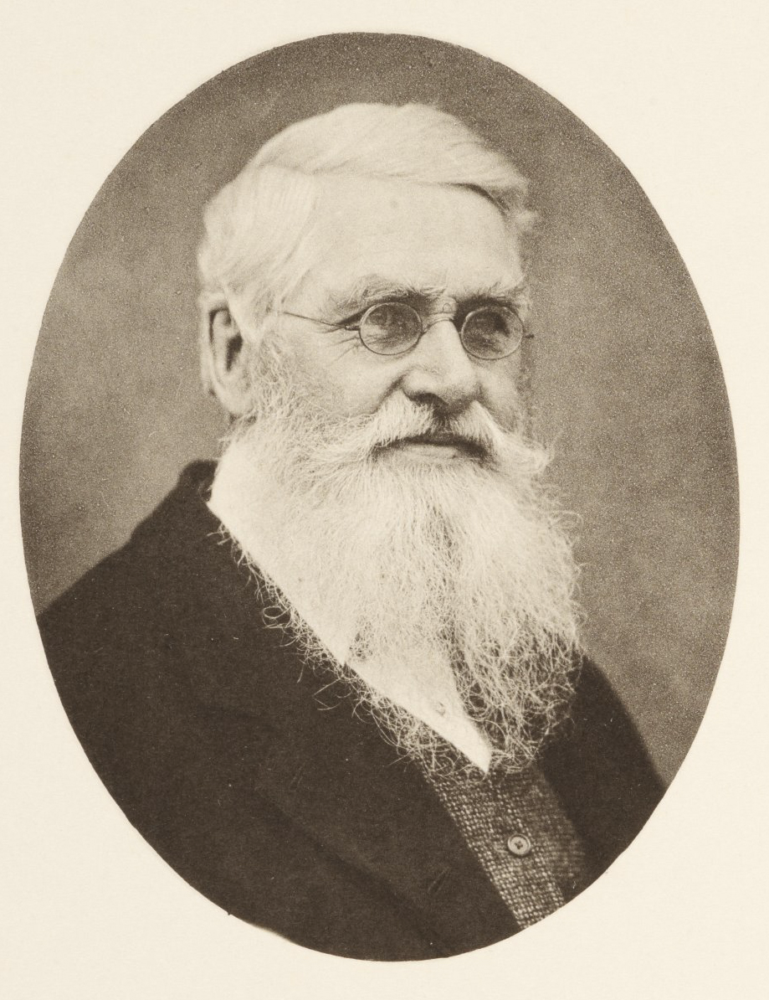
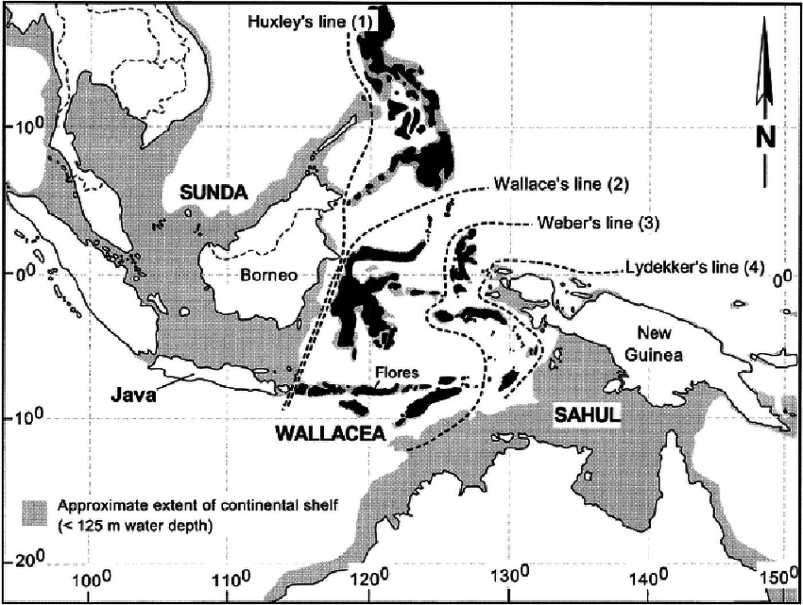
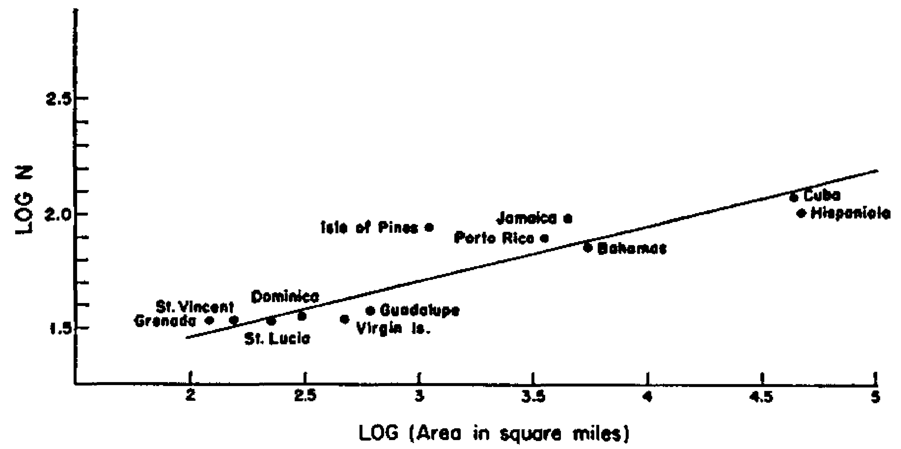

{width="200px" style="float:right; padding-left:10px"}

Ever since [Alfred Russel Wallace](https://en.wikipedia.org/wiki/Alfred_Russel_Wallace)'s pioneering expeditions to the Malay Archipelago, during which he realised the fundamental differences between neighbouring faunas and their link to the independent evolutionary dynamics that ensue after geographical isolation, ecologists have tried to understand the underlying mechanisms behind the observed geographical distributions of animal and plant species.

Wallace, now considered the father of biogeography, but also jointly with Darwin one of the original proponents of the theory of evolution by natural selection, proposed the separation between islands in the Indonesian Archipelago according to whether the animal species on those islands where from Asian or Australasian origins, in what is now known as Wallace's line.

{width="380px" style="float:left; padding-right:10px"}
The study of the spatial distribution of species has revealed recurrent patterns in the way biodiversity is organised and how it changes across spatial scales, as well as the implications of this organisation for community composition and structure. It has also prompted the development of ecological theory aimed at understanding the mechanisms behind these spatial patterns. Spatial processes thus have since then emerged as one of the fundamental drivers of biodiversity.

One of the spatial patterns of biodiversity that has attracted most attention, not only for its simplicity, but also because of its universality, is the relationship between the size of the area sampled and the number of species found within.

## 2.1- Species-Area relationships

Arguably one of the only true laws in ecology is the species-area relationship. **Species-Area Relationships (SARs)** describe the relation between area sampled and the number of species present in that area. Species-area relationships were first described by Arrhenius in 1921, who observed similar scaling relationships across plant communities. Since then, many ecologists have collected similar data of species richness across different expanses of areas. Many empirical systems have thus been shown to follow general scaling patterns and this pattern can be described by a **power law**!

{width="500px"}

**Species-area relationship of showing bird species richness as a function of island size in the West Indies.** Image taken from Preston, FW (1962) *The canonical distribution of commonness and rarity: Part I*. ***Ecology***. 43:2, 185-215. 

The seminal paper by [Preston in 1962](https://www.jstor.org/stable/1931976) building upon Arrhenius work and presenting SARs like the one above for different faunas, presented canonical values for the parameters of the power law form of the SARs:

$$
S = c A^z     
$$

where *S* is species richness, *c* is a proportionality constant, *A* is the area size, and *z* is the scaling exponent of the relationship. Applying the logarithm to both sides of the equation above, we can linearize and obtain the expression:

$$
ln(S) = ln(c) + z * ln(A)
$$

Making easy to fit a straight line to the log-log relationship of species richness with area size, and the reason why most of the times we see that relationship represented as in the plot above.

The value of *z* across systems was shown by Preston, and many others after him, to be in the range of 0.1 and 0.5 and usually around the value of 0.25. The existence of this canonical value suggests profound general principles of community richness, and makes it a powerful predictive tool that has been used ever since in biodiversity conservation and studies of extinction during biotic collapse. The value of *c* and its universality is more debated (see [Lomolino's account](http://ecflora.cavehill.uwi.edu/bio_courses/ECOL2453/pdfs/species%20area%20relationship.pdf) for a nice discussion of the topic).

## 2.2- The Theory of Island Biogeography

The discovery of 'true ecological laws' such as SARs represented an important advance for the field and for our efforts to better understand biodiversity and its distribution. However, as Simon Levin ([1992](https://esajournals.onlinelibrary.wiley.com/doi/10.2307/1941447)) elegantly puts it:

***"Understanding patterns in terms of the processes that produce them is the essence of science, and is the key to the development of principles for management."***

In 1967, two of the most prominent ecologists, Edward O. Wilson and Robert MacArthur, attempted to provide a mechanistic explanation for the distributional patterns of species using a graphical and mathematical framework. This framework has become to be known as the Theory of Island Biogeography. Ever since their development, the Theory of Island Biogeography has formed the backbone of our thinking on species distributions and accummulation of species with area.

## 2.3- Extending the Theory

## 2.4- Network-Area Relationships

## References

Arrhenius, O (1921) Species and area. ***Journal of Ecology***, 9:1, 95-99.

Levin, SA (1992), The problem of pattern and scale in ecology: The Robert H. MacArthur award lecture. ***Ecology***, 73, 1943-1967.

Lomolino, MV (2000) Ecology's most general, yet protean pattern: The species-area relationship. ***Journal of Biogeography***, 27, 17-26.

Preston, FW (1962) The canonical distribution of commonness and rarity: Part I. ***Ecology***, 43:2, 185-215.

## [Continue to Networks as Graphs](lesson-4.html){.continue-link}
