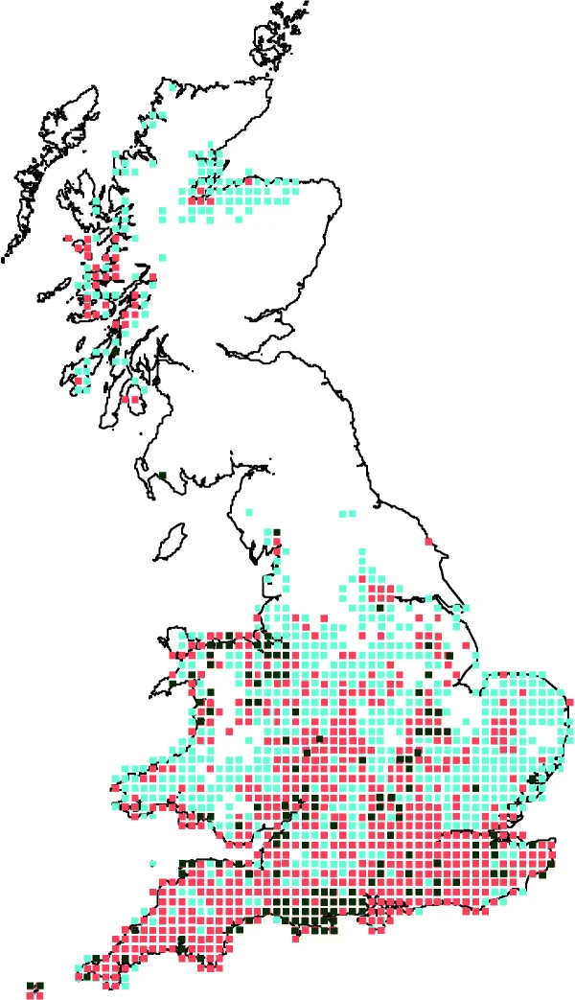
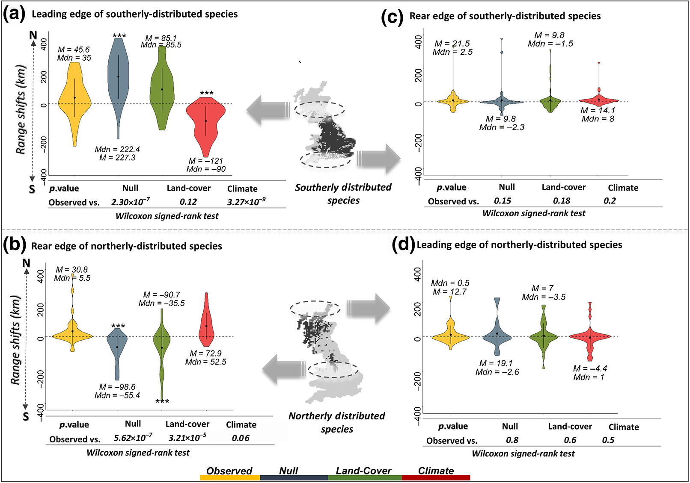
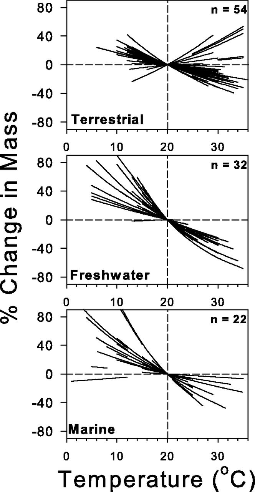
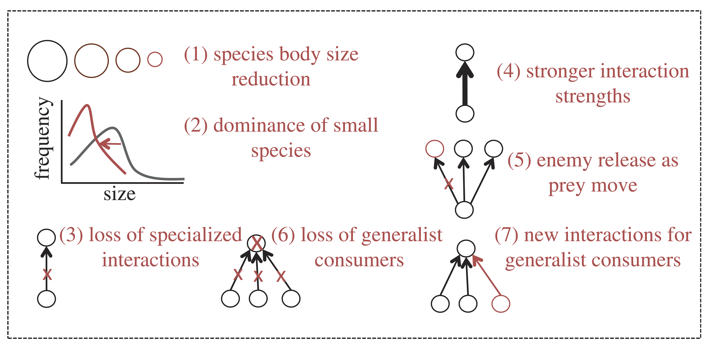
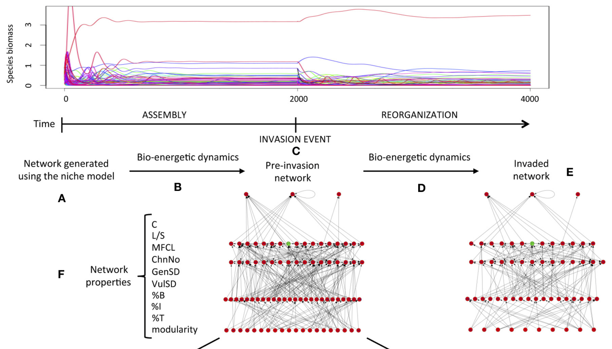
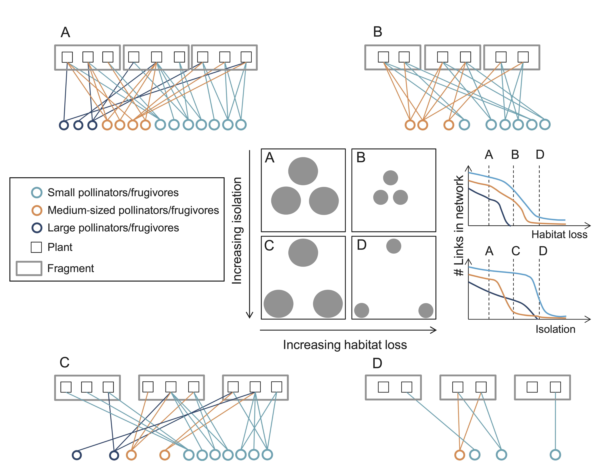

Human disturbance has caused, and will continue to cause, profound impacts on all ecosystems across the world. Taken together, the effects that human impact have started to cause what has been called the 6th Mass Extinction, which we are currently witnessing. This mass extinction is comparable to previous mass extinction events such as the Cretaceous-Paleogene, in the sense that by different estimates the extinction rate of specie is currently [between 100–1,000 times greater than the background extinctions rate](https://onlinelibrary.wiley.com/doi/full/10.1111/brv.12816). 

These impacts have translated, among other things, into a fundamental reorganisation of biodiversity across spatial and temporal scales. The main drivers of this anthropogenically-derived global change on biodiversity modification include: habitat loss and fragmentation, global warming, biological invasions, among others. In order to design sound conservation policies and strategies to mitigate these impacts on biodiversity, as well as to fully understand their effects on ecosystems we need predictive theory that allow us to link ecological mechanisms to ecosystem organisation and responses to change.

{width="200px" style="float:right; padding-left:10px"}

## 3.1 Warming
Warming has prompted a series of responses from species. Three main universal responses to warming have been identified across species and taxonomic groups.

### Range shifts

In an attempt to track their ideal climatic conditions (i.e. to maximise fitness) species have shifted their geographical distribution ranges polewards latitudinally, and towards higher elevations altitudinally. Even though responses vary among species, this aspect of biodiversity reorganisation is more or less universal.

Given this, current research has focused on identifying potential universal drivers of species range shifts that might improve our predictive ability of species range shifts. Recent efforts to understand the determinants of differential shifts across bird species in the UK have revealed that both land cover and climate both differentially affect species that are more distributed towards the north vs more southernly species.

<center>
{width="600px"}
</center>

<br>
The first step in the analysis of range shifts is quantifying the actual shifts. Below we can see an example on how to calculate these shifts. We use the **Breeding and wintering bird distributions in Britain and Ireland from citizen science bird atlases** dataset provided by the British Trust of Ornithology (BTO). The dataset can be downloaded from the BTO [website](https://www.bto.org/our-science/data/what-data-are-available). In this example we quantify range shift as the shift in the leading edge (northern boundary) of the biogeographical distribution of the species. Alternative ways of quantifying shifts exist and you can find many examples in the literature!

To facilitate data sharing and loading from a remote server, I have subset the species provided in the BTO database to include only those present in more than 500 and less that 3000 10km grid cells in the map of the main British Isle.

**VERY IMPORTANT:** If you are going to use these data for your own projects please do not use it straight from this repository. Refer to the BTO's website (link above) and follow their instructions and guidelines concerning data usage.

```{r fig.align='center', message=FALSE, warning=FALSE, out.width="100%", eval=TRUE}
# load the required libraries
library(ggplot2) 
library(tidyverse)
library(sp)
library(rnaturalearth)
library(egg)

## Load map
sf_UK  <- ne_countries(scale = "medium", country = 'United Kingdom', returnclass = "sf")

# Coordinate reference system
proj.latlon <- CRS("+proj=longlat +datum=WGS84")

# some other parameters for the coordinate projection system
ukgrid <- "+init=epsg:27700"
latlong <- "+init=epsg:4326"

## BTO Distribution data
BTO_distrib <- read.csv("https://raw.githubusercontent.com/mlurgi/serrapilheira_eco_networks/master/datasets/bto/distributions-filtered.csv", header=T) # period, sp code, season and grid for GB and Ireland

## BTO Species names data
BTO_sp <- read.csv("https://raw.githubusercontent.com/mlurgi/serrapilheira_eco_networks/master/datasets/bto/species_lookup.csv", header=T)

## BTO grid data
BTO_grid <- read.csv("https://raw.githubusercontent.com/mlurgi/serrapilheira_eco_networks/master/datasets/bto/grid_square_coordinates_lookup.csv", header=T)

# Subset distribution data to Britain. This is no longer necessary due to the pre-filtered database, but I left it here for illustration
BTO_distrib <- as_tibble(BTO_distrib) %>% filter(island=="B" & season=="B" & resolution==10)

# The BTO data is split into three periods: "1968-72" "1988-91" "2008-11", which we term here P.1, P.2 and P.3 respectively
BTO_distrib$periodN <- paste0("P.", as.numeric(droplevels(as.factor(BTO_distrib$period))))

# this is a numerical code assigned by the BTO to each species, to resolve it, we use the species_lookup dictionary
BTO_distrib$Spec <- paste0("Sp", BTO_distrib$speccode)
BTO_distrib$Pres <- 1

#####################
# Grid and BTO Locations
# Coordinates: We obtain the coordinates of the centre for each grid cell
Coord10 <- as_tibble(BTO_grid) %>%
  dplyr::filter(resolution==10 & order<5) %>%
  dplyr::group_by(grid) %>%
  dplyr::summarise(long = mean(long), lat = mean(lat))

# Merge the grid cell information with the grid cells in the distribution data
Loc10 <- BTO_distrib %>% dplyr::select(grid) %>% distinct(grid)

# Join coordinates to location data
Loc10 <- Loc10 %>%  left_join(Coord10)
# Filter missing coordinates
Loc10 <- Loc10 %>%  filter(!is.na(long) & !is.na(lat))

# Plot the coordinates on the map to make sure they make sense
ggplot(data = sf_UK) + geom_sf() +
  geom_point(data = Loc10, aes(x = long, y = lat), size = 1, shape = 23, fill = "darkred")

# Join coordinates to occurrence data
BTO_distrib <- BTO_distrib %>%  left_join(Loc10, by='grid')
BTO_distrib <- BTO_distrib %>% filter(!is.na(long) & !is.na(lat))

#####################
# BTO Species
## 3 different periods
period <- unique(BTO_distrib$period)

# Nb of grid cells species have been observed
Ngrid <- BTO_distrib %>%
  dplyr::group_by(speccode, periodN) %>%
  dplyr::summarise(ngrid = n()) # group size
Ngrid <- pivot_wider(Ngrid, id_cols = speccode, names_from = periodN, values_from =ngrid)

Spec <- as.tibble(BTO_sp)
Spec  <- Spec %>%  left_join(Ngrid, by = c("speccode" = "speccode"))

# We only consider species present in at least 50 cells across all time periods
Spec  <- Spec %>% filter(P.1>=50 & P.2>=50 & P.3>=50) 

# Now that we have the data organised we can look at the range shift of some sample species through time
safe_colorblind_palette <- c("#88CCEE", "#CC6677", "#DDCC77")

#################
loc = merge(Loc10, BTO_distrib[which(BTO_distrib$speccode == 95),])
Spec[which(Spec$speccode == 95),]

a <- ggplot(data = sf_UK) + geom_sf() + geom_point(data = loc, aes(x = long, y = lat, colour = period), size = 1, shape = 15) + scale_colour_manual(values = safe_colorblind_palette[1:3])+
  geom_hline(yintercept = max(BTO_distrib$lat), linetype="dashed") + geom_hline(yintercept = min(BTO_distrib$lat), linetype="dashed") + 
  ggtitle("Mergus merganser") + ylab("") + xlab("") + theme_classic(base_size =  11) + theme(legend.position = 'none')

#################
loc = merge(Loc10, BTO_distrib[which(BTO_distrib$speccode == 272),])
Spec[which(Spec$speccode == 272),]

b <- ggplot(data = sf_UK) + geom_sf() + geom_point(data = loc, aes(x = long, y = lat, colour = period), size = 1, shape = 15) + scale_colour_manual(values = safe_colorblind_palette[1:3])+
  geom_hline(yintercept = max(BTO_distrib$lat), linetype="dashed") + geom_hline(yintercept = min(BTO_distrib$lat), linetype="dashed") + 
  ggtitle("Streptopelia turtur") + ylab("") + xlab("") + theme_classic(base_size =  11) + theme(legend.position = 'bottom')

#################
loc = merge(Loc10, BTO_distrib[which(BTO_distrib$speccode == 120),])
Spec[which(Spec$speccode == 120),]

c <- ggplot(data = sf_UK) + geom_sf() + geom_point(data = loc, aes(x = long, y = lat, colour = period), size = 1, shape = 15) + scale_colour_manual(values = safe_colorblind_palette[1:3])+
  geom_hline(yintercept = max(BTO_distrib$lat), linetype="dashed") + geom_hline(yintercept = min(BTO_distrib$lat), linetype="dashed") + 
  ggtitle("Falco subbuteo") + ylab("") + xlab("") + theme_classic(base_size =  11) + theme(legend.position = 'none')

ggarrange(a,b,c,nrow=1)

#####################
# And lastly, we compute range shifts!

## Here we quantify range shift as the difference in mean location of the 20 most northern records (leading edge) between the time period P.1 and the time period P.3. I.e. the northern edge shift from 1972 to 2011
spec_speccode <- Spec$speccode
df_rangeshift <- data.frame(speccode=spec_speccode)
for(i in 1:nrow(Spec)){
lat.all_P.1 <- sort(data.frame(BTO_distrib %>% filter(speccode == spec_speccode[i], periodN=="P.1") %>% dplyr::select(lat))$lat)
  lat.all_P.3 <- sort(data.frame(BTO_distrib %>% filter(speccode == spec_speccode[i], periodN=="P.3") %>% dplyr::select(lat))$lat)
  
  # leading edge position
  lat.max20_P.1 <- tail(sort(lat.all_P.1), 20)
  lat.max20_P.3 <- tail(sort(lat.all_P.3), 20)
  
  # position of original latitudinal centre
  df_rangeshift$lat_centre_P.1[i] <- mean(lat.all_P.1)
  
  # difference in latitude
  df_rangeshift$shift_max20_P.1.3[i] <- mean(lat.max20_P.3) - mean(lat.max20_P.1)
}

# Now we plot the range shifts ranked by magnitude
plot(rank(df_rangeshift$shift_max20_P.1.3), df_rangeshift$shift_max20_P.1.3, pch=16, xlab='rank', ylab='northern edge shift')

# And how the shift relates to the centre of the range...
plot(df_rangeshift$lat_centre_P.1, df_rangeshift$shift_max20_P.1.3, pch=16, xlab='latitudinal centre', ylab='range shift')

```

### Body size

{width="300px" style="float:right; padding-left:10px"}

A second universal response to climate change is changes on body size. Both within species and the distribution of body sizes across species within communities. This response can be linked to three classical ecological hypotheses relating temperature to body size.

1.- **[Bergmann's rule](https://en.wikipedia.org/wiki/Bergmann%27s_rule)** states that species and organisms or larger sizes tend to be found in colder environments, while small-sized species and organisms tend to inhabit warmer regions.

2.- **James' rule** states that within the same species, populations of smaller-sized individuals would be found in the warmest parts of the species' range.

3.- **The temperature size rule** stating that individual body size (in ectotherms) decreases with increasing temperature.

Taken together, these three rules can help us generate hypotheses on the potential effects of warming on natural communities. In particular, it would be expected (and it has been demonstrated in natural populations), that both individuals within species (by reaching maturity earlier) are becoming smaller in general, and the body size distributions of species within communities are being shifted towards smaller values. This has profound consequences for the networks of ecological interactions between species.

### Vital rates
A further observed effect of warming on natural populations is a generalised [increase on the pace of life](https://theconversation.com/live-fast-die-small-how-global-heating-is-simplifying-the-worlds-ecosystems-144976). Productivity and respiration have been observed to increase with temperature in aquatic mesocosms, impacting the balance between the distribution of individuals of different species across trophic levels.

Ecological interactions such as predator-prey relationships have been observed to be affected by these changes in vital rates. Predators live faster, and as such they need to eat more prey to satisfy their metabolic demands. In controlled experiments, attack rates of predators have been observed to increase with temperature, while at the same time handling time (the time a predator employs in processing a prey item) has been observed to decrease. These phenomena prompt an increase in the strength of predator-prey interactions, making the effects of predator populations on their prey stronger. If sustained over large ecological time scales, this trend has the potential to lead to the extinction of prey species, and their predator itself as a consequence.

### Consequences for ecological interactions

The species' responses to warming identified above, either acting along or in tandem, have the potential to prompt a radical reorganisation of ecosystems across the globe. This reorganisation can facilitate the emergence of novel communities from climate change in which networks of species interactions display different structural properties relative to the communities from which they originated. These changes in structure can have profound consequences for the persistence and stability of ecosystems.


<center>
{width="400px"}
</center>
<center>
**Effects of warming on species interactions** Image taken from Lurgi et al. (2012).
</center>

<br>

In particular, **novel communities are expected to be characterised by**:

1.- A reduction of species body sizes <br>
2.- A shift in the distribution of body sizes within communities (with a dominance of small species)<br>
3.- The loss of specialised interactions (due to the range expansion of species that encounter new partners)<br>
4.- An increase in the strength of ecological interactions<br>
5.- Enemy release as prey move at a different pace than their predators<br>
6.- A loss of generalist consumers (from source communities from which species move out)<br>
7.- New interactions for generalist consumers (within sink communities into which species move in)<br>


## 3.2 Extinctions and Invasions

{width="450px" style="float:right; padding-left:10px"}

Due to the intricate networks of ecological interactions between species within ecosystems, the addition or removal of species can have profound consequences for community composition. Cascading effects of these perturbations through the network of interactions can cause secondary extinctions, the extent of which highly depend on the topology and structural properties of the network. Surprisingly, [networks that resemble the structure of food webs are less robust](https://royalsocietypublishing.org/doi/10.1098/rstb.2008.0219) to extinctions (i.e. node deletion) than those with more random topologies. Similarly, the addition of new species into fully assembled model food webs drastically reduces their complexity by prompting a series of cascading extinctions and the concomitant effects they cause.

This highlights the fragility of ecological networks and poses the pressing challenge of developing predictive frameworks capable of helping us understand the full extent of the consequences of extinctions and invasions on complex ecological networks in order to design sound ecosystem conservation strategies.

The development of predictive frameworks for complex ecosystems relies on mathematical and computational tools. One approach is the use of ordinary differential equations (ODEs) to simulate network dynamics. The history of dynamical modelling of this kind in ecology began back in the 1920's with the works by Alfred J. Lotka and Vito Volterra. Lotka and Volterra developed independently a similar set of two coupled differential equations to study the dynamics of biological systems in general (Lotka) and the effect of restricting fisheries for predatory fish in the Adriatic Sea (Volterra). These equations have become to be known as the Lotka-Volterra model, and it is one of the most used mathematical models in ecology to study the temporal dynamics of predator and prey populations.

{width="200px" style="float:right; padding-left:10px"}

$$
\frac{dx}{dt} = \alpha x - \beta xy
$$
<br>
$$
\frac{dy}{dt} = \delta xy - \gamma y
$$
where $x$ and $y$ are the abundances of prey and predator respectively, and $\alpha, \beta,\delta,$ and $\gamma$ are the model parameters that control the intrinsic growth rate of the prey species, the prey loss due to predatory attack, the gain of the predator when consuming prey (which includes the efficiency of the energy transfer across trophic levels), and the death rate of predators, respectively.

For a very nice mathematical analytical treatment of these equations and their implications for population dynamics and community stability see a [very nice exposition of the topic](https://stefanoallesina.github.io/Sao_Paulo_School/) developed by [Prof Stefano Allesina](https://ecologyandevolution.uchicago.edu/faculty/stefano-allesina-phd) for a previous edition of the ICTP-SAIFR School on Community Ecology: From Patterns to Principles.

Here, our focus is on how to use these coupled equations to simulate dynamics of many species in a network with a given pattern of connectivity that determines these interactions. In the general case of the equations above, when extended to many species we can write the equations in a comprised format thus:

$$
\frac{dN_i}{dt} = N_i \left(r_i + \sum_{j=1}^{n} \alpha_{ij}N_j \right) , i = 1 ... n
$$
where $N_i$ are the abundance of species $i$, $r_i$ is the intrinsic growth (or death) rate of species $i$ (positive for intrinsically growing basal species, and negative for consumers), and the $\alpha_{ij}$'s represent the interaction coefficients between species. If we further compact all interaction coefficients into matricial form, and represent abundances and growth rates as vectors we obtain:

$$
\frac{dN}{dt} = N * (r+AN)
$$

To solve a system of ODEs like the one above numerically, we can use programming libraries available that perform the numerical integration for us. These are available across many platforms, although here we stick to R.

```{r, generalised-lv, warning=FALSE, error=FALSE, message=FALSE}
# loading required libraries
require(deSolve)
require(igraph)

# Defining the generalised Lotka-Volterra model
# Taken from Allesina's code (see link in the text)
generalised.LV <- function(t, x, parameters){
  with(as.list(c(x, parameters)), {
    x[x < 10^-8] <- 0 # to avoid prevent numerical problems
    dxdt <- x * (b + A %*% x)
    list(dxdt)
  })
}

# This function is for performing simulation experiments
run_community_dynamics <- function(A, b){
  nb_species <- dim(A)[1]			# the number of species
  nb_pos <- length(which(A > 0))		# the number of + interactions
  nb_neg <- length(which(A < 0))		# the number of - interactions
  pos <- runif(nb_pos, 0, 0.05)	# uniform distribution positive effects
  neg <- runif(nb_neg, -0.5, 0)	# uniform distribution negative effects

  A[A<0] <- neg
  A[A>0] <- pos
  
  # initial abundances from a uniform distribution between 0 and 1
  N0 <- runif(nb_species, 0.01, .1)
  
  # definition of time
  t.values <- seq(0, 500, by=0.01)
  
  # here we set the values of the parameters that the equations take
  params <- list(b = b, A = A)
  
  # solve numerically
  glv.out <- ode(y = N0, times = t.values, func = generalised.LV, parms = params)
  return(glv.out)
}

set.seed(924)				# setting seed for reproducibility

# We define the interaction matrix / network A
A <- matrix(c(-1,-1,0,0,-1,0,
              1,0,-1,1,0,0,
              0,1,0,0,0,0,
              0,-1,0,-1,-1,0,
              1,0,0,1,0,-1,
              0,0,0,0,1,0), 6, 6, byrow = TRUE)


# here we run the simulations using the network above
b <- c(1, -0.02, -0.02, 1, -0.02, -0.02)
output <- run_community_dynamics(A, b)

# And we plot the results...
##### Stuff for layouting the network ######
## This is just layouting instructions for the network to look pretty. Don’t waste too much time in this
food_web_layout <- matrix(c( -1.37859603, -3.5772072,
                             -1.37859603, -0.0374094,
                             -1.37859603,  3.5772072,
                             1.37859603, -3.5772072,
                             1.37859603, -0.0374094,
                             1.37859603,   3.5772072), 6, 2, byrow=TRUE)

# This is to ensure we plot the network as we want to see it
A_plot <- t(A)
diag(A_plot) <- 0
g <- graph_from_adjacency_matrix(A_plot)

# defining the colours for the figures
colours <- c('red2', 'black', 'darkolivegreen3', 'darkcyan', 'darkorchid1', 'blue')
##################


par(fig=c(0,10,0,10)/10)
par(mar=c(5,5,0,0))
matplot((output[,c(2:7)]), type = 'l', lty = 1, lwd = 2, ylab='Abudance', xlab='Time',col= colours, ylim=c(0,5))
par(fig=c(6.5,9.5,5.5,10)/10)
par(new=T, mar=c(0,0,0,1))
plot(g, layout=food_web_layout, vertex.color = colours, vertex.label.color='white', vertex.size=25, vertex.label.cex=1)

```

On models like this we can then remove or add species and assess the effect that those perturbations have on the resulting community. For example, removing species 4 from the network above results in more stable populations of consumers (i.e. less drastic fluctuations) and reduced abundance of top predator species (compare abundances of top species 3 across plots).

```{r, extinction, warning=FALSE, echo=FALSE, error=FALSE, message=FALSE}
A_no_4 <- matrix(c(-1,-1,0,-1,0,
                   1,0,-1,0,0,
                   0,1,0,0,0,
                   1,0,0,0,-1,
                   0,0,0,1,0), 5, 5, byrow = TRUE)


set.seed(924)				# setting seed
b <- c(1, -0.02, -0.02, -0.02, -0.02)
output_extinction <- run_community_dynamics(A_no_4, b)

# plotting the results
# new network (without species 4) requires new layout
food_web_layout_2 <- matrix(c( -1.37859603, -3.5772072,
                             -1.37859603, -0.0374094,
                             -1.37859603,  3.5772072,
                             1.37859603, -0.0374094,
                             1.37859603,   3.5772072), 5, 2, byrow=TRUE)

# again just to plot the new network
A_plot <- t(A_no_4)
diag(A_plot) <- 0
g <- graph_from_adjacency_matrix(A_plot)

par(fig=c(0,10,0,10)/10)
par(mar=c(5,5,0,0))
matplot((output_extinction[,c(2:6)]), type = 'l', lty = 1, lwd = 2, ylab='Abudance', xlab='Time', col=colours[-4])
par(fig=c(6.5,9.5,5.5,10)/10)
par(new=T, mar=c(0,0,0,1))

plot(g, layout=food_web_layout_2, vertex.color = colours[-4], vertex.label.color='white', vertex.size=25, vertex.label.cex=1, vertex.label=c(1:3, 5,6))

```

One of the challenges in setting up models like the Generalised Lotka-Volterra is that when many species are considered, it is difficult to find a combination of parameters (growth rates and interaction terms) that yield persistent communities (i.e. the system becomes quickly unstable for many species). This difficulty has been tackled by many ecologists over the last few decades and the current models used to simulate ecological dynamics in complex networks have increased in complexity and level of biological and ecological detail. One of the most popular formulations currently used by food web ecologists to model dynamics in complex food webs is the **Bio-Energetic Model**. The Bio-Energetic Model incorporates the scaling of vital rates with species body size (given by trophic position in the food web), as well as more realistic (saturating) functional responses. This additions make the system more stable and capable of maintaining many interacting species.

In a couple of recent papers, I used this model to investigate [the effects of invasions of complex food webs comprising many species](https://www.frontiersin.org/articles/10.3389/fevo.2014.00036/full) (~60) and also, by making the species' vital rates dependent not only on body size but also temperature, to explore the [synergistic effects of increased temperatures and invasions on food webs](https://royalsocietypublishing.org/doi/full/10.1098/rspb.2020.2622). If you are interested you can explore this modelling framework which is available from my repository: https://github.com/mlurgi/temperature-dependent-invasions

## 3.3 Habitat loss
In 1974, the pioneering tropical ecologist Daniel H. Janzen, while studying the complex ecosystems of Costa Rica, realised that the lack of sufficient habitat for a species (due to habitat loss) can create situations in which, even if populations of the species still persist, they are no longer able to perform their ecological functions due to a reduced capacity of fulfilling the ecological interactions that would allow them to perform these functions. This realisation led him to conclude that even if the consequences of habitat loss are not apparent when looking at biodiversity loss (i.e. species do not go extinct), they are no longer interacting in a way that maintains true biodiversity in the sense of a healthy ecosystem. Janzen wrote:

***" What escapes the eye, however, is a much more insidious kind of extinction: the extinction of ecological interactions."*** *Daniel H. Janzen (1974).*

Ecological interactions then, and the complex networks they form, are expected to be lost much earlier than species. Evaluating the effects of habitat loss based solely on measures of species diversity can paint a misleading picture, [leading us to greatly underestimate the actual damage on ecosystem organisation](https://theconversation.com/habitat-loss-doesnt-just-affect-species-it-impacts-networks-of-ecological-relationships-117687).

``` {r echo = FALSE, fig.cap = "**Effects of habitat loss on network structure.** Image taken from Hagen et al. (2012)", out.width='100%', fig.align='center'}

```

Habitat loss can also have biased effects on the organisation of networks of ecological interactions by differentially affecting different species groups. For example, larger animal species in ecosystems usually require larger areas to maintain viable populations. This means that in fragmented habitats we should expect to observe a bias towards smaller species, with the corresponding changes expected on network structure due to this targeted loss.

To investigate the effects of habitat loss on complex ecological networks we can use models such as those discussed during the previous section ([The Assembly of Ecological Networks Across Spatial Scales](lesson-3.html)). In those models habitat loss can be simulated by removing nodes from the network of available patches. Alternatively, space can be considered more explicitly, as for example using individual-based models, in which simulated individuals move around in an artificial ecosystem. In a recent study, we investigated the effects of habitat loss on multiplex ecological networks comprising 2 interaction types, trophic and mutualistic interactions. Our results show that different types of habitat loss (either random loss across the landscape, continuous loss where entire large fractions of the habitat are destroyed, or intermediate more clustered habitat loss scenarios). By preventing individuals from finding each other across the landscape, encounters between predators and prey are reduced in random habitat loss scenarios, decreasing the interaction strengths between species. Contiguous habitat loss on the other hand, by 'compressing' the landscape of available habitat, makes interactions more likely and increase the strengths of these interactions, in turn decreasing community stability.

<center>
{width="600px"}

</center>

Our individual-based framework to investigate the effects of habitat loss on complex species interaction networks is available as a Python application here: https://github.com/cm1788/Stability-of-multitrophic-communities-under-habitat-loss. Feel free to try it!

## References

Cowie, RH, Bouchet, P and Fontaine, B (2022) The Sixth Mass Extinction: fact, fiction or speculation? ***Biological Reviews***, 97, 640-663.

Dunne, JA. and Williams RJ (2009) Cascading extinctions and community collapse in model food webs. ***Phil. Trans. R. Soc. B*** 364, 1711–1723.

Hagen, M. et al. (2012) Biodiversity, species interactions and ecological networks in a fragmented world. ***Adv. in Ecol. Res.***, 46, 89-210.

Janzen, DH (1974) The deflowering of Central America. ***Natural History***, 83(4):48-53.

Leakey, RE, & Lewin R. (1995) *The sixth extinction: Patterns of life and the future of humankind.* Doubleday, New York. pp. 271.

Lurgi, M. et al. (2012) Novel communities from climate change. ***Phil. Trans. Roy. Soc. B.*** 367, 2913-2922.

Lurgi, M., Galiana, N., López BC., Joppa, LN. and Montoya, JM. (2014) Network complexity and species traits mediate the effects of biological invasions on dynamic food webs. ***Frontiers in Ecology and Evolution***, 2:36.

McWilliams, C, Lurgi, M, Montoya, J.M. et al. (2019) The stability of multitrophic communities under habitat loss. ***Nature Communications***, 10:2322.

Parmesan, C., Ryrholm, N., Stefanescu, C. et al. (1999) Poleward shifts in geographical ranges of butterfly species associated with regional warming. ***Nature***, 399, 579–583.

Rall, BC. et al. (2012) Universal temperature and body-mass scaling of feeding rates. ***Phil. Trans. Roy. Soc. B.*** 367(1605), 2923-2934.

Taheri, S, García-Callejas, D, Araújo, MB. (2021) Discriminating climate, land-cover and random effects on species range dynamics. ***Global Change Biology***, 27, 1309– 1317. 

Yvon-Durocher, G. et al. (2010) Warming alters the metabolic balance of ecosystems. ***Phil. Trans. Roy. Soc. B.*** 365(1549), 2117-2126.


## [Continue to Ecological Applications](lesson-5.html){.continue-link}
