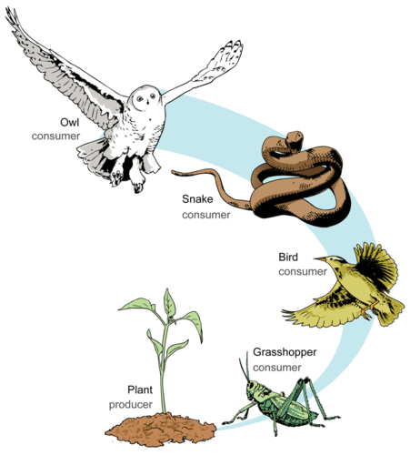

Aside from the connectivity measures that we learnt in the previous section, more interesting properties can be calculated on ecological networks. In this chapter, we introduce some of these properties and how to calculate them.

## Horizontal Diversity : Generality and Vulnerability

Ecological networks are all about species and their interactions. In food webs, these interactions represent consumer-resource relationships, so the set of relationships that a consumer has with its prey is considered the 'breadth' of its diet. This diet breadth is a measure of the generality of the consumer species and a mean generality index can be calculated across the network to have an idea of how generalist are species in the network on average. We can calculate generality on the matrix representation of our food webs using the following function:

```{r}
## Mean generality of species in the network
Generality <- function(M){
  return(sum(colSums(M))/sum((colSums(M)!=0)));
}
```

Similarly, we can obtain a measure of the average number of consumers that resources on our networks have (i.e. vulnerability) using the following function on our adjacency matrix:

```{r}
## Mean vulnerability of the species in the network
Vulnerability <- function(M){
  return(sum(rowSums(M))/sum((rowSums(M)!=0)));
}

```

To be able to compare these quantities across different networks, they are usually normalised by the average number of links per species (`L/S`).

If we are interested in these quantities at the species level, we simply count their prey or predator numbers or their `degree` in the network:

```{r}
## In-degree or number of prey of all species in the network
InDegree <- function(M){
  return(colSums(M));
}

## Out-degree or number of predators of all species in the network
OutDegree <- function(M){
  return(rowSums(M));
}
```

Even though these measures are useful to have an idea of the average diet breadth and number of consumers across species in our networks, in many occasions it is desirable to look at the deviation of these properties, since we can have within the same network generalist species such as this guy on the left... ... alongside very specialist species, such as this guy on the right...

{width=325} {width=350}


To assess variability in diet breadth and the degree of vulnerability of species in a food web, metrics such as the standard deviation of normalised generality and vulnerability are useful. These properties can be calculated using the following formulae:

&nbsp;&nbsp;&nbsp;&nbsp;&nbsp;&nbsp;    &nbsp;&nbsp;&nbsp;&nbsp;&nbsp;&nbsp;&nbsp;&nbsp;&nbsp;&nbsp;    

where a<sub>ij</sub> are the i,j values of the adjacency matrix `A` representing the food web.

Using R code they can be calculated thus:


```{r}
## Standard deviation of generality:
SDGenerality <- function(M){
  return(sd(colSums(M) / (sum(M)/dim(M)[1]) ));
}

## Standard deviation of vulnerability:
SDVulnerability <- function(M){
  return(sd(rowSums(M) / (sum(M)/dim(M)[1]) ));
}

```

## Vertical Diversity : Fraction of Species Types

In food webs, we can categorise species according to the role the perform from an ecosystem functioning point of view. Basal resources are species at the base of food chains. They are in charge of converting organic and inorganic compounds into biomass such as, for example, plants or phytoplankton. It is interesting to know the fraction of species in food webs that belong to this category.


{style="float: right;margin-right: 7px;margin-top: 7px;"}


```{r}
## Fraction of basal species
FractionOfBasal <- function(M){
  M_temp <- M;
  diag(M_temp) <- 0;
  
  b_sps <- sum(which(InDegree(M_temp) == 0) %in% which(OutDegree(M_temp) >= 1));
  
  return(b_sps / dim(M)[1]);
}
```

Similarly, knowing the fraction of species belonging to intermediate and top consumer categories can give us information about the degree of predation pressure and top-down regulation expected in the network, and its corresponding community, being analysed.

```{r}

## Fraction of top predator species
FractionOfTop <- function(M){
  M_temp <- M;
  diag(M_temp) <- 0;
  
  t_sps <- sum(which(InDegree(M_temp) >= 1) %in% which(OutDegree(M_temp) == 0));
  
  return(t_sps / dim(M)[1]);
}
```

```{r}
## Fraction of intermediate consumer species
FractionOfIntermediate <- function(M){
  M_temp <- M;
  diag(M_temp) <- 0;
  
  i_sps <- sum(which(InDegree(M_temp) >= 1) %in% which(OutDegree(M_temp) >= 1));
  
  return(i_sps / dim(M)[1]);
}
```

For the Benguela food web we can obtain these properties using the functions defined above.

```{r}

library(RCurl)
x <- getURL("https://raw.githubusercontent.com/mlurgi/networks_for_r/master/datasets/benguela.edgelist")
benguela.EL <- read.table(text = x) 
benguela.EL <- as.matrix(benguela.EL)

# Create an adjacency matrix called benguela.AM, containing only zeros
benguela.AM <- matrix(0, max(benguela.EL), max(benguela.EL))

# Introduce ones to the matrix to represent interactions between species
benguela.AM[benguela.EL] <- 1

gen <- Generality(benguela.AM)
vul <- Vulnerability(benguela.AM)
sdgen <- SDGenerality(benguela.AM)
sdvul <- SDVulnerability(benguela.AM)
B <- FractionOfBasal(benguela.AM)
I <- FractionOfIntermediate(benguela.AM)
T <- FractionOfTop(benguela.AM)

```

## Vertical Complexity : Mean Food Chain Length

Food chains like those illustrated in the figure above are the exception rather than the norm in nature. Ecological communities are way more complex than this, such as the Benguela food web we saw before. You can imagine a real ecological community as a collection of interconnected food chains. One way to summarise this complexity is to calculate the average length of food chains in the network, i.e. the average number of links from basal resources to top predators or mean food chaing length.

To be able to quantify this, we need to visit all paths in our network running from each basal species to each top predator species. This is a computing intensive task that, for large networks, requires large computational resources (including long execution times). In graph theory and network topology, there is considerable research devoted into how to best count [average paths in networks](https://en.wikipedia.org/wiki/Average_path_length). If you are interested, this is a fascinating area of research and you can play with functions such as [distances](https://igraph.org/r/doc/distances.html) on igraph to find out more.

In food webs, the paths we are interested in are special because they all start in basal resources and they all stop at top predators. So, the way in which we should count those paths is a bit different than what functions such as `distances` do. Fortunately, there exist libraries for food web analysis that can help us calculate metrics and statistics particularly tailored for food webs. One such a package is [cheddar](http://quicklizard99.github.io/cheddar/). Cheddar let's you calculate all of the food web properties we have seen so far and many more. We will take advantage of cheddar to calculate mean food chain length. This will also get you familiar with cheddar and you can explore many more functionalities offered by the package.

Calculating mean food chain length using cheddar:

```{r}
MeanFoodChainLength <- function(M){
  require(cheddar)
  M <- t(M)
  node <- 1:dim(M)[1];
  for(n in 1:length(node)){
    node[n] <- paste(node[n],'-');
  }
  
  pm <- matrix(M, ncol=dim(M)[2], dimnames=list(node, node), byrow=TRUE);
  
  # We need to convert our adjacency matrix into a Cheddar community object.
  # For this, we yse PredationMatrixToLinks()
  community <- Community(nodes=data.frame(node=node), trophic.links=PredationMatrixToLinks(pm), properties=list(title='Community'));
  
  # We remove cannibalistic links to avoid entering an infinte loop when calculating path lengths
  community <- RemoveCannibalisticLinks(community, title='community');
 
  chain.stats <- TrophicChainsStats(community)
  ch_lens <- (chain.stats$chain.lengths + 1)
  
  return(sum(ch_lens)/length(ch_lens));
}

```

## Degree Distributions


***

## [Continue to Parameters](lesson-6.html){.continue-link}
