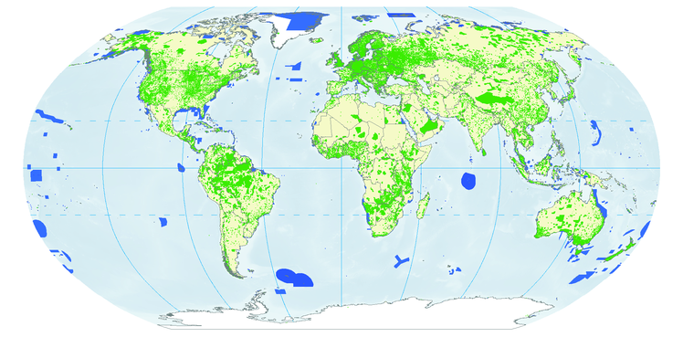
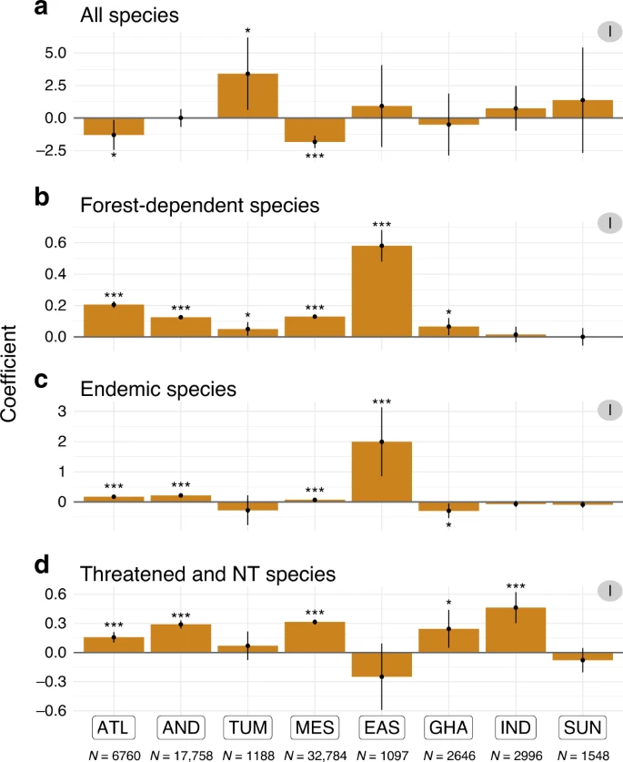
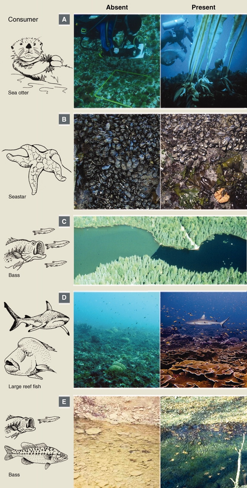
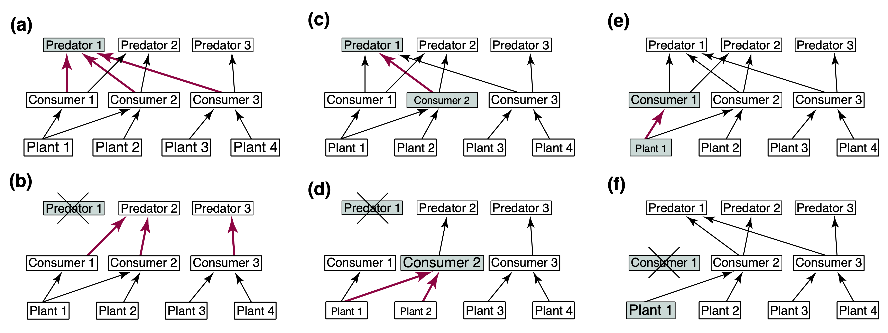
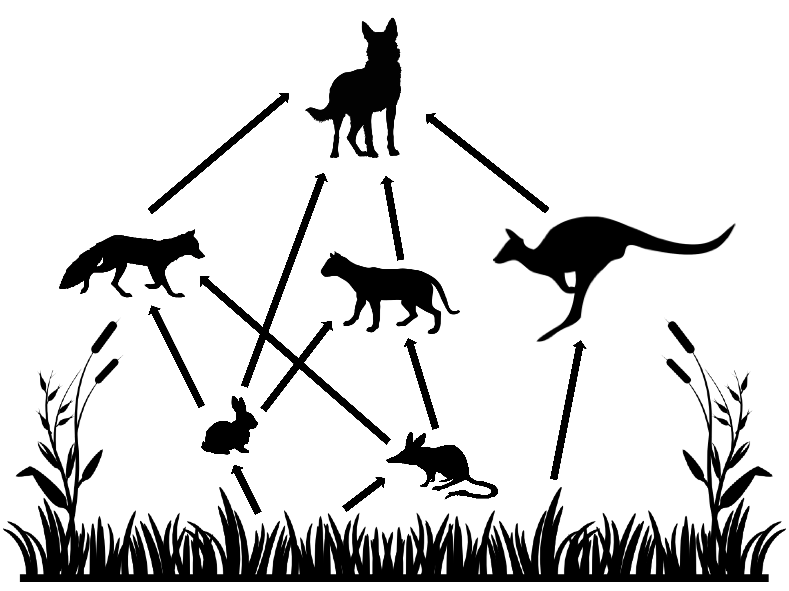
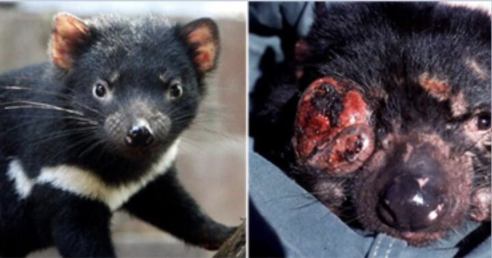
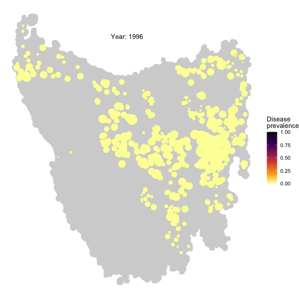

As we saw in the previous section, ***different stressors associated to global change are prompting a dramatic re-organisation of ecosystems worldwide***. Their most studied and noticeable effect is species loss, but another facet of biodiversity, species interactions, is also affected.

To counter the effects of these stressors, different conservation measures are adopted. In many cases these measures are devised in an ad-hoc manner and rarely consider the full community-level consequences of adopting them.

## Protected Areas for Biodiversity Conservation

{width="500px" style="float:right; padding-left:10px"}

One of the prime examples of measures adopted specifically aimed at protecting biodiversity is the establishment of protected areas for conservation. ***Protected areas are parts of the landscape (or seascape, in the case of marine protected areas) within which human activities are reduced to one extent or another***. Different levels of protection exist, depending on the type and magnitude of human activities allowed within. In the strictest sense, protected areas with the highest level of protection forbid any kind of human activities. For obvious reasons (e.g. exploitation of natural resources for the benefit of humans and economic growth), establishing protected areas with the highest level of protection is very difficult. Strictly protected areas are thus usually found in remote locations of little interest or value to humans.

{width="400px" style="float:left; padding-right:10px"}

Ideally, rather than setting them up in locations of little economic interest to humans, protected areas should be designed in such a way to obtain the most effective outcome to protect biodiversity, either at the species or the ecosystems level. Research efforts aiming at designing effective protected areas have been developed grounded on mechanistic models and theory that rely heavily on spatial biodiversity considerations akin to those explored in [Section 2](lesson-3.html) (e.g. Moilanen et al. 2009). Mechanistic ecological models can thus help us define effective conservation strategies.

In spite of the availability of these frameworks, many protected areas around the world are still set up as a last resort when particular habitats are threatened and only a fraction of them is left. In many instances, the effectiveness of these protected areas is not known. Recent efforts have focused on obtaining a better understanding of this. Cazalis et al. ([2020](https://doi.org/10.1038/s41467-020-18230-0)) (plot on the left) showed that ***when looking at the number of species of forest birds, the effect of protected areas in tropical forests on biodiversity is negligible, and in some cases even detrimental***. This picture changes when focusing on specific species groups. Disparate results like this highlight the need for obtaining a better understanding of conservation actions, such as protected areas, on biodiversity at regional to global scales. In particular, we need a better understanding of how effective are these areas at protecting other facets of biodiversity, such as species interactions.

At the [Computational Ecology Lab](https://www.swansea.ac.uk/bioscience/research-and-impact/computational-ecology-lab/) we are working towards this understanding from a network perspective, with the ultimate goal of assessing the effectiveness of protected areas in protecting species interactions networks and the properties that they confer to ecosystems.


## Managing Invasive Species: The Community Context Matters

{width="320px" style="float:right; padding-left:10px"}

One of the classical results in theoretical food web ecology is ***the importance of the potential for cascading effects of species removals (or disturbance) on other species in the ecosystem*** (e.g. Pimm, 1982). Ever since then, field ecologists set out find examples of this in Nature. It turns out there are many! (see Estes et al., 2011 for a review).

This realisation is important because it has profound implications for the ways we approach ecosystems. It not only highlights the indirect effects that species might have on each other when they are tangled in a complex networks of species interactions in ecosystems, but it also warns us of the potential hidden effects that can be caused on ecosystems by the disturbance of individual species. These effects might not be apparent until they become irreversible. For example, secondary extinctions after the removal or introductions of species.

***One scenario in which these indirect effects are of fundamental importance is when developing management strategies for invasive species***. Once invasive species have established themselves in native ecosystems, they become integral part of the ecosystem structure and dynamics. Actions aimed at removing established alien species are thus expected to produce changes in the ecosystem comparable to those resulting from removing other native species.

The figure below (taken from Zavaleta et al. 2001) shows some examples of the likely effects of removing invasive species that have been established in ecosystems either by themselves or with other alien species.


<center>
{width="800px"}
</center>
<center>
**Invasive species removal from an ecosystem perspective**. Idealized food webs indicating trophic interactions between species. Coloured boxes represent exotic species and white boxes represent native species. Arrow thickness indicates the strength of trophic interaction. Font size represents population size. **(a)** shows a community containing a single exotic predator. In **(b)**, removal of this predator increases native prey populations. **(c)** shows a community containing both an exotic predator and an exotic herbivore. In **(d)**, removal of only the exotic predator releases the exotic herbivore population, with cascading impacts on two plant species. **(e)** shows a community containing both an exotic herbivore and an exotic plant species. In **(f)**, removal of the exotic herbivore only releases the exotic plant population. ***Image and caption taken from Zavaleta et al. (2001)***.
</center>

<br>

Predicting the full effects of invasive species removal on ecosystems can be a difficult task, especially if we aim at more quantitative predictions than those shown in the figure above. In [2018](https://doi.org/10.1111/1365-2664.13188) we aimed at this focusing on the Australian semi-arid ecosystem, which has been invaded by several introduced species such as the European rabbit (*Oryctolagus cuniculus*), the red fox (*Vulpes vulpes*), and the feral cat (*Felis catus*). **We aimed at obtaining a better understanding of the potential cascading effects of managing (by culling) rabbits (the invasive species focus of control actions) on the rest of the ecosystem**, with a particular emphasis on small marsupial species. In Australia, the introduction of rabbits in particular, has been identified as one of the causes of extinction and drastic decline of several endemic marsupial species. It is then important to understand the full effects of potential management actions aimed at protecting these species.


{width="350px" style="float:right; padding-left:10px"}

To tackle this problem we adopted a model similar in spirit to the Generalised Lotka-Volterra model introduced in the previous section but in discrete time. ***When modelling ecological dynamics of species displaying non-overlapping generations, discrete time (or difference, rather than differential) equations are usually adopted.*** In this example functional responses (i.e. the predation effect of predator over prey) and the numerical responses (i.e. the growth of a species population accounting for intrinsic growth, consumption and loss to predation) are modeled independently and are different across species. The food web modeled can be seen on the right, and the equations governing the numerical and functional responses of the herbivores are presented below. The remaining equations are similar with slight modifications depending on the shape of functional and numerical responses of the different species observed in empirical studies. The full set of equations is not presented here for simplicity, but you are welcome to find the full details of the model in [Lurgi et al. 2018](https://besjournals.onlinelibrary.wiley.com/doi/10.1111/1365-2664.13188).

Numerical response of herbivores:

$$
r_{N,t} = -a_N + c_N [1-exp(-d_NV_{t-1})] - P_{t-1}
$$

where *N* is the species identifier, $r_{N,t}$ is the growth rate of species *N* at time *t*, $a_N$ its maximum instantaneous rate of decline, $c_N$ is the rate at which $a_N$ is ameliorated, $d_N$ is the demographic efficiency of species *N*, $V_{t - 1}$ is the pasture biomass at previous time step, and $P_{t - 1}$ is the total predation pressure on species *N* from all its predators during the previous time step.

Functional responses of herbivores:

$$
B_{t,N} = (w_N^{3/4}) v_N [1-exp(-V_t/f_N)] X_{t-1}
$$
where *B* is the biomass harvested for consumption from the resources, *w* is the average body weight, $v$ is the maximum consumption rate of the herbivore species, $V_t$ is the vegetation biomass at time *t*, *f* is the foraging efficiency of the herbivore, and $X_{t - 1}$ is the abundance of the herbivore in the previous time step.

The computer code for this model (including the equations not shown above but that can be found in the paper) is presented below. You can use this code to run simulations that will yield the results of experiments modeling the disturbance (in the form of decreased abundance, to simulate culling) of rabbits in the ecosystem and the corresponding effects on the other species in the food web within which it is embedded.

Before defining the model we need to initialise a series of empirically derived parameters. All this information comes from intensive study of the system.

```{r, parameters-australian-web, warning=FALSE, error=FALSE, message=FALSE}
#### Parameter values
veg_term1 <- 55.12
veg_term2 <- 0.0153
veg_term3 <- 0.00056
veg_term4 <- 2.5

min_fox <- 0.0001
min_cat <- 0.0001

roo_weight <- 26

##### fox parameters
min_r_fox <- 0.56
upper_r_fox <- 0.77
d_fox <- 3.2            # demographic efficiency

max_c_fr <- 1.096
max_c_fb <- 1.096

# half saturation density for functional responses
hs_rab_f <- 1.32      # over rabbit
hs_bilby_f <- 0.99    # over bilby
##### end fox parameters

##### cat parameters
min_r_cat <- 0.56
upper_r_cat <- 0.81
d_cat <- .6  # this is the demographic efficiency for cats - varied between 2 and 5 in Robley's report

max_c_cr <- 0.874
max_c_cb <- 2.874

# half saturation density for functional responses
hs_rab_c <- 0.5       # over rabbit
hs_bilby_c <- 0.99    # over bilby
##### end cat parameters

##### small native mammal parameters
bilby_weight <- 0.782
min_r_bilby <- 4.6
upper_r_bilby <- 5.5
d_bilby <- 0.0045
##### end small native mammal parameters

##### rabbit parameters
rabbit_weight <- 0.782
min_r_rabbit <- 4.6
upper_r_rabbit <- 5.5
d_rabbit <- 0.0045

# the following two parameters are applied to both rabbits and small mammals
max_c_rv <- 0.068       # maximum intake of vegetation by rabbit
f_rv <- 138             # foraging efficiency of rabbit on vegetation
###### end rabbit parameters


##### dingo parameters
max_c_dk <- 0.68      # maximum intake rate of kangaroo
f_dk <- .1            # foraging efficiency on kangaroo

max_c_dr <- 0.2       # maximum intake rate of rabbit
f_dr <- .4            # foraging efficiency on rabbit

min_r_dingo <- 1.22   # maximum rate of decrease
max_r_dingo <- 0.63
d_dingo <- 2.5       # demographic efficiency of dingo
K_dingo <- 0.003      # carrying capacity of dingo per hectare

d_int_fox <- .7      # maximun killing rate of fox
d_int_cat <- .3       # maximum killing rate of cat

f_df <- 0.3           # foraging efficiency on fox
f_dc <- 0.3           # foraging efficiency on cat
##### end dingo parameters

##### kangaroo parameters
min_r_roo <- 1.6      # maximum rate of decrease of kangaroo
upper_r_roo <- 1.7496
d_roo <- 142.9

max_c_kv <- 0.086
f_kv <- 34
##### end kangaroo parameters

```

Once the parameters above are defined, we can implement the model equations.

```{r, model-australian-web, warning=FALSE, error=FALSE, message=FALSE}
# This function contains the model specifications. It executes one single iteration of the model
# following the mathematical formulation presented in Lurgi et al. (2018) Journal of Applied Ecology
ExecuteIterationGeneralised <- function(current_abs, i, current_qt, kill='', fraction=0){
  ###### species order (and index) in current_abs (and next_abs) (vectors of abundances):
  ###### vegetation (1), rabbit (2), small-mammal (3), kangaroo (4), fox (5), cat (6), dingo (7)
  
  veg <- current_abs[1]
  rabbits <- current_abs[2]
  bilby <- current_abs[3]
  roos <- current_abs[4]
  fox <- current_abs[5]
  cat <- current_abs[6]
  dingoes <- current_abs[7]
  
  if(current_qt == 3){
    if(kill == 'rabbit'){ rabbits <- rabbits - (rabbits * fraction) }
    if(kill == 'dingo' ){ dingoes <- dingoes - (dingoes * fraction) }
    if(kill == 'fox'){ fox <- fox - (fox * fraction) }
    if(kill == 'cat'){ cat <- cat - (cat * fraction) }
  }
  
  R <- rainfall_data[ceiling(i/4),(current_qt+1)]
  
  ####### gains (numerical responses)
  veg_per_ha <- veg/8000
  
  veg_growth <- (-veg_term1) - (veg_term2 * veg_per_ha) - (veg_term3 * (veg_per_ha**2)) + (veg_term4 * R)
  
  veg_growth <- veg_growth * 8000
  
  g_rabbits <- ( ( (max_c_fr / rabbit_weight) * ((rabbits)**2))  / ( ((hs_rab_f*8000)**2) + (rabbits)**2) )
  rabbits_taken_fox <- ((365/4) * ( ((fox) * g_rabbits)  / (rabbits) )) 
  
  g_rabbits_cat <- (( (max_c_cr / rabbit_weight) * (rabbits)) / (( hs_rab_c * 8000) + (rabbits)))
  rabbits_taken_cat <- ((365/4) * ( ((cat) * g_rabbits_cat)  / (rabbits) )) 
  
  g_bilbies <- ( ( (max_c_fb/ bilby_weight) * (bilby))  / ( (hs_bilby_f * 8000) + (bilby)) )
  bilbies_taken_fox <- ((365/4) * ( ((fox) * g_bilbies * (1 - (g_rabbits/max_c_fr)) )  / (bilby) ))
  
  g_bilbies_cat <- ( ( (max_c_cb / bilby_weight) * (bilby))  / ( (hs_bilby_c * 8000) + (bilby)) )
  bilbies_taken_cat <- ((365/4) * ( ((cat) * g_bilbies_cat * (1 - (g_rabbits_cat/max_c_cr)) )  / (bilby) ))
  
  bilby <- (bilby *  exp( (-min_r_bilby + (upper_r_bilby *(1 - exp(-d_bilby*veg/8000) ))) - bilbies_taken_fox - bilbies_taken_cat ) ) 
  
  if(is.na(bilby) | bilby < (0.08*8000)){
    bilby <- (0.08*8000)
  }
  
  #functional response of dingo
  I_dingo <- .745 * (1-exp(-(roos/8000)/f_dk))
  I_dingo_rab <- max_c_dr * (1-exp(-(rabbits/8000)/f_dr))
  dingo_numerical <- ( (-min_r_dingo + ((I_dingo + I_dingo_rab) * d_dingo)) )
  
  ##### in the following the variable 'dingo_numerical', which is actually the rate
  ##### of increase of the dingo, is divided by 4 because this is an annual rate of increase
  ##### see Forsyth's code for details...
  if(dingo_numerical < 0){
    dingoes <- dingoes * exp(dingo_numerical/4)
  }else{
    dingo_numerical <- (dingo_numerical * ( 1 - (dingoes / (K_dingo * 8000) )))/4  #### 24 is the carrying capacity for dingo at 8000 ha
    if(dingo_numerical > max_r_dingo){
      dingo_numerical <- (max_r_dingo)/4
    }
    dingoes <- dingoes * exp(dingo_numerical)
  }
  
  if(is.na(dingoes) | dingoes < (0.0000025 * 8000)){
    dingoes <- (0.0000025 * 8000)
  }
  
  ##### kangaroos taken by dingo
  roos_taken <-  dingoes * I_dingo
  #### numerical response of kangaroo
  roos <- (roos * exp( ( - min_r_roo + (upper_r_roo * ( 1 - exp( - (veg/8000) / d_roo ) )) )/4  )) - roos_taken
  
  if(is.na(roos) | roos < (0.001 * 8000)){
    roos <- (0.001 * 8000)
  }
  
  #### rabbits losses and numerical reponses
  rabbits_taken_dingo <- ((365/4) * ( ((dingoes) * I_dingo_rab)  / (rabbits) )) 
  rabbits_taken <- rabbits_taken_fox + rabbits_taken_cat + rabbits_taken_dingo
  rabbits <- (rabbits *  exp( (- min_r_rabbit + (upper_r_rabbit *(1 - exp(-d_rabbit*veg/8000) ))) -  rabbits_taken  )) 
  
  if(is.na(rabbits) | rabbits < (0.08*8000)){
    rabbits <- (0.08 * 8000)
  }
  
  # numerical responses of fox and cat
  # d_int is the predator intake efficiency - in this case how good they are at killing the other predators
  I_dingo_fox <- d_int_fox * (1 - exp(-(fox/8000)/f_df))
  fox_killed_dingo <- ((dingoes * I_dingo_fox) * (365/4))
  fox <- (fox * (exp( -min_r_fox + (upper_r_fox * (1 - exp(-d_fox*(rabbits/8000 + bilby/8000) ) ) ))) - fox_killed_dingo)
  
  # from the report: r =−a+c(1−e−dR)−hF
  I_dingo_cat <- d_int_cat * (1-exp(-(cat/8000)/f_dc))
  cat_killed_dingo <- ((dingoes * I_dingo_cat) * (365/4))
  cat <- (cat * exp( -min_r_cat + (upper_r_cat * (1 - exp(-d_cat * (rabbits/8000+bilby/8000) ) )) ) - cat_killed_dingo)
  
  if(fox < (min_fox*8000)){
    fox <- (min_fox * 8000)
  }
  
  if(cat < (min_cat * 8000)){
    cat <- (min_cat * 8000)
  }
  
  veg <- veg + veg_growth
  
  ######## vegetation losses (functional responses of herbivores)
  veg_taken_rabbits <- ((rabbits) * ( ( max_c_rv * (1-exp(-(veg/8000)/f_rv)) * (rabbit_weight**(0.75)) ) * (365/4) ))
  veg_taken_bilby <- ((bilby) * ( ( max_c_rv * (1-exp(-(veg/8000)/f_rv)) * (rabbit_weight**(0.75)) ) * (365/4) ))
  veg_taken_roos <- (roos * ( ( max_c_kv * (1-exp(-(veg/8000)/f_kv)) * (roo_weight**(0.75)) ) * (365/4) ))
  
  veg <- veg - veg_taken_rabbits - veg_taken_bilby - veg_taken_roos
  
  if(veg < 0){ veg <- 10 }
  
  next_abs <- c(veg, rabbits, bilby, roos, fox, cat, dingoes)
  
  responses <- c(veg_taken_rabbits, veg_taken_bilby, veg_taken_roos, rabbits_taken_fox, bilbies_taken_fox, rabbits_taken_cat, bilbies_taken_cat, rabbits_taken_dingo, roos_taken, fox_killed_dingo, cat_killed_dingo)
  
  return(list(next_abs=next_abs, responses=responses))
}

```

As you can see in the code above, one of the defining features of applied models (i.e. those targeted to a particular system for which we want to obtain specific predictions) are full of parameters that have very specific and precise values. These values are usually (as in this case) extracted from empirical information that has been collected over many years of study of the corresponding system. This illustrates ***one of the key differences between developing ecological models to study specific systems, commonly for very applied problems (like the example above), and ecological models to construct theory and derive theoretical expectations on the behaviour of a broader class of systems*** (like the Generalised Lotka-Volterra example discussed in the previous section).

Now that we have the implementation of the model, we can run some simulations and study the behaviour of the system.


```{r, simulations-australian-web, warning=FALSE, error=FALSE, message=FALSE}
# Seed to ensure reproducibility
set.seed(9315)

# numbers of time step in the simulation
steps <- 600

# values extracted from empirical observations of the abundance ranges of each species
veg <- runif(1, min=1600000, max=3200000)
rabbit <- runif(1, min=17600, max=120000)
sm <- runif(1, min=17600, max=120000)
roo <- runif(1, min=400, max=1600)
fox <- runif(1, min=48, max=72)
cat <- runif(1, min=7.2, max=17.6)
dingo <- runif(1, min=2.4, max=24)

dynamics <- array(dim=c(steps, 7))
dynamics[1,] <- c(veg, rabbit, sm, roo, fox, cat, dingo)

steps_per_qt <- ceiling(steps/4)+1

#### rainfall data from Lerida (Yathong)
rainfall_data <- data.frame('1'=rnorm(steps_per_qt,99,69), '2'=rnorm(steps_per_qt,87,67), '3'=rnorm(steps_per_qt,82,39), '4'=rnorm(steps_per_qt,80,49))
rainfall_data[rainfall_data < 0] <- 0

current_qt <- 1

# the species to be managed
sp <- 'rabbit'

# the management level
l <- 0

for(i in 1:(steps-1)){
  cur_abs <- dynamics[i,]
  
  # control is only applied for a fraction of the simulation between timesteps 200 and 400
  if(i >= 201 & i <= 400){
    exec <- ExecuteIterationGeneralised(cur_abs, i, current_qt, sp, l)
    next_abs <- exec$next_abs
  }else{
    exec <- ExecuteIterationGeneralised(cur_abs, i, current_qt)
    next_abs <- exec$next_abs
  }
  
  dynamics[(i+1),] <- next_abs
  current_qt <- (current_qt+1)%%4
}

matplot(log10(dynamics[,-1]), type='l', lty=1, col=c(1,2,3,4,5,6), ylim=c(-.5,7), ylab = 'log10(abundance)', xlab = 'timestep')
legend('top', c("rabbit", "s-m", "roo", "fox", "cat", "dingo"), pch = "-", col = c(1,2,3,4,5,6), box.lwd=0, y.intersp = 1.5, horiz=TRUE, lwd=3, adj=c(1,1.5))

```


And if we change the value of parameter $l$ from the code above to any other value between 0 and 1, such as for example, 0.9, we can see **what happens in the community when the rabbit abundance is reduced** by that amount:

```{r, simulations-australian-web-with-control, warning=FALSE, error=FALSE, message=FALSE, echo=FALSE}
# Seed to ensure reproducibility
set.seed(9315)

# numbers of time step in the simulation
steps <- 600

# values extracted from empirical observations of the abundance ranges of each species
veg <- runif(1, min=1600000, max=3200000)
rabbit <- runif(1, min=17600, max=120000)
sm <- runif(1, min=17600, max=120000)
roo <- runif(1, min=400, max=1600)
fox <- runif(1, min=48, max=72)
cat <- runif(1, min=7.2, max=17.6)
dingo <- runif(1, min=2.4, max=24)

dynamics <- array(dim=c(steps, 7))
dynamics[1,] <- c(veg, rabbit, sm, roo, fox, cat, dingo)

steps_per_qt <- ceiling(steps/4)+1

#### rainfall data from Lerida (Yathong)
rainfall_data <- data.frame('1'=rnorm(steps_per_qt,99,69), '2'=rnorm(steps_per_qt,87,67), '3'=rnorm(steps_per_qt,82,39), '4'=rnorm(steps_per_qt,80,49))
rainfall_data[rainfall_data < 0] <- 0

current_qt <- 1

# the species to be managed
sp <- 'rabbit'

# the management level
l <- 0.9

for(i in 1:(steps-1)){
  cur_abs <- dynamics[i,]
  
  # control is only applied for a fraction of the simulation between timesteps 200 and 400
  if(i >= 201 & i <= 400){
    exec <- ExecuteIterationGeneralised(cur_abs, i, current_qt, sp, l)
    next_abs <- exec$next_abs
  }else{
    exec <- ExecuteIterationGeneralised(cur_abs, i, current_qt)
    next_abs <- exec$next_abs
  }
  
  dynamics[(i+1),] <- next_abs
  current_qt <- (current_qt+1)%%4
}

matplot(log10(dynamics[,-1]), type='l', lty=1, col=c(1,2,3,4,5,6), ylim=c(-.5,7), ylab = 'log10(abundance)', xlab = 'timestep')

legend('top', c("rabbit", "s-m", "roo", "fox", "cat", "dingo"), pch = "-", col = c(1,2,3,4,5,6), box.lwd=0, y.intersp = 1.5, horiz=TRUE, lwd=3, adj=c(1,1.5))

```

Using the above routine, we performed a series of replicated simulations to investigate the potential consequences of removing a highly invasive species (the rabbit) from the Australian semi-arid ecosystem shown above. [Our results suggest](https://doi.org/10.1111/1365-2664.13188) that the managed control of this invasive species can be beneficial for the community (measured as an increase of the abundance of a target species of conservation concern) up to a certain extent, but applying larger levels of control (i.e. increasing the fraction of rabbit killed) can have unintended consequences on native populations. Levels of rabbit population control above 40% can have negative consequences for native small mammals when compared with lower levels of control.

<center>
![***Effects of rabbit removal on small native mammal and mesopredators.*** Change in median abundance (calculated for the last 10 years of the rabbit control period) from the no rabbit control baseline plotted against the fraction of rabbit removal for three species in the food web: small mammal, cat, and fox. Values below 0 represent smaller abundances compared to a no rabbit control scenario. Points represent the mean abundance values across the 5,000 replicates. Lines show a local polynomial regression fit to the whole dataset (i.e., 5,000 replicates per fraction of rabbit removal). Shaded areas represent 90% confidence intervals on the simulated data. Taken from Lurgi et al. (2018).](lesson-images/food-web-dingo-result.png){width="800px"}

</center>


## Controlling Disease Spread in Wildlife Populations

**Disease spread within wildlife populations is a major issue of conservation concern.** Traditionally, the behaviour of disease dynamics in populations is studied using SIR(S)-type models. SIR(S) models, as in Susceptible, Infected, and Recovered (or Susceptible -again-), are state-based models in which the focus is on tracking the dynamics of the number (or fraction) of susceptible, infected, and recovered (or susceptible again) individuals within the population through time. These kind of models are specified thus:

$$
\frac{dS}{dt} = -\beta \times I \times S
$$
$$
\frac{dI}{dt} = \beta \times I \times S - \gamma \times I
$$

$$
\frac{dR}{dt} = \gamma \times I
$$

where *S* is the number / fraction of susceptible, *I* of infected and *R* of recovered individuals, respectively. Susceptible individuals become infected with an infectious contact rate of $\beta$ when encountering an infected individual, and infected individuals recover from the disease at a rate $\gamma$. In SIR models, infected individuals exit the system when they move to the recovered state. In SIS models, on the other hand, infected individuals become again susceptible and can become infected again.

The code below provides an implementation of the SIR model and the resulting dynamics when the model is integrated through time.

```{r, SIR, warning=FALSE, error=FALSE, message=FALSE}

# Code for the implementation of the SIR model for disease dynamics
# Taken from: https://rpubs.com/choisy/sir

require(deSolve)
sir_equations <- function(time, variables, parameters) {
  with(as.list(c(variables, parameters)), {
    dS <- -beta * I * S
    dI <-  beta * I * S - gamma * I
    dR <-  gamma * I
    return(list(c(dS, dI, dR)))
  })
}

# definition of parameters and their values
parameters_values <- c(
  beta  = 0.004, # infectious contact rate (/person/day)
  gamma = 0.5    # recovery rate (/day)
)


# the initial conditions for the model
initial_values <- c(
  S = 999,  # number of susceptibles at time = 0
  I =   1,  # number of infectious at time = 0
  R =   0   # number of recovered (and immune) at time = 0
)

# time
time_values <- seq(0, 10, by= 0.001)

# giving the model to the solver with parameter values and time
sir_values_1 <- ode(y = initial_values, times = time_values, func = sir_equations, parms = parameters_values)

# formatting
sir_values_1 <- as.data.frame(sir_values_1)

# plotting the results
with(sir_values_1, {
# plotting the time series of susceptibles:
  plot(time, S, type = "l", col = "blue", xlab = "time (days)", ylab = "number of people")
# adding the time series of infectious:
  lines(time, I, col = "red")
# adding the time series of recovered:
  lines(time, R, col = "green")
})

# adding a legend:
legend("right", c("susceptibles", "infectious", "recovered"), col = c("blue", "red", "green"), lty = 1, bty = "n")

```

These models have provided important insights into the dynamics of epidemiological systems and have been applied to understand and predict specific epidemics. Disease transmission is however, an inherently individual-to-individual interaction process. In some instances, ***the mechanisms of interaction that might affect the outcome of disease transmission dynamics cannot be investigated using system-level models*** like the equations above. One solution to this is the use of individual-based models.

### Technical note: Individual-based models

In individual-based models, ***"rules" of interaction at the individual level are defined, and the system level behaviour emerges from these interactions at lower organisational scales***. In the app below you can explore the use of a simple individual-based model for epidemics behaviour using the NetLogo modelling platform. The flexibility of the platform allows for easy definition of individual-level rules of interaction and parameter values manipulation.

***NOTE***: If the frame below doesn't load visit [this URL](https://www.netlogoweb.org/launch#https://www.netlogoweb.org/assets/modelslib/Sample%20Models/Biology/Virus.nlogo).

<iframe style="width:900px; height:900px;" src="https://www.netlogoweb.org/launch#https://www.netlogoweb.org/assets/modelslib/Sample%20Models/Biology/Virus.nlogo" data-external="1">
</iframe>


### The spread of Devil Facial Tumour Disease (DFTD) in Tasmanian devil metapopulations

{width="350px" style="float:right; padding-left:10px"}

The last remnants of Tasmanian devil populations in Tasmania, Australia, have been drastically decreasing due to the introduction of a transmissible cancer, DFTD, in 1996. By means of local aggressive interactions between individuals the cancer is capable of spreading between them, having profound consequences for population persistence. Obtaining a good understanding of the drivers of disease spread in these wild populations is of fundamental importance to be able to develop sound conservation measures to protect the species from collapse.

<center>
{width="600px"}

</center>


In an effort to tackle this problem, [we developed an individual-based metapopulation model](https://doi.org/10.3390/pathogens10121592) in which local dynamics of interactions between individuals interact with regional scale processes of dispersal across local populations in a metapopulation to give rise to large scale dynamics of disease spread. This model not only was capable of reproducing the wavefront of disease spread across the island of Tasmania, but allowed us to identify the conditions of dispersal and local contact distance under which this is expected to happen.

{width="300px" style="float:left; padding-right:10px"}

***Check the full code for this project here!*** [https://github.com/RowanDurrant/DFTD](https://github.com/RowanDurrant/DFTD), including the local rules of interaction defined to simulate disease transmission between individuals and movement across the landscape.

Using this information, and the model parameterised in this way, we designed conservation management strategies aimed at reducing the spread of the disease across the metapopulation. Our results suggest that ***if metapopulations of Tasmanian devils were to be managed -by isolating certain patches from the metapopulation- using a landscape scale approach based on betweenness centrality of patches (a measurement of how central a local population is within the network of patches), the proportion of patches infected at the landscape level is considerably lower than if a random approach, or even one based solely on patch degree (i.e. number of dispersal corridors arriving at and emanating from a given patch) is taken***. In other words, if local patches to be isolated from the metapopulation are selected based on their betweenness centrality, the proportion of infected patches remains lower than if alternative topology-oriented strategies are adopted.

Note that in terms of population size and within-population genetic variation, both strategies yield similar outcomes: a decrease in both quantities as more patches are isolated.

<center>
![***Effects of fragmentation on DFTD spread in Tasmanian devil metapopulations.*** Metapopulation size (A), proportion of individuals infected within the metapopulation (B) and mean within-population genetic diversity index (C) are influenced by the number of populations isolated from the metapopulation. Proportion of populations infected is also influenced by whether populations are isolated based on the population’s centrality in the metapopulation (i.e., betweenness), its connectivity (i.e., degree) or at random (B). Colours represents different population isolation methods. ***Figure and caption from Durrant et al. (2021).***](lesson-images/results-devils.png){width="800px"}

## References

Cazalis V, Princé K, Mihoub JB et al. (2020) Effectiveness of protected areas in conserving tropical forest birds. ***Nature Communications*** 11, 4461. https://doi.org/10.1038/s41467-020-18230-0

Durrant R, Hamede R, Wells K & Lurgi M. (2021) Disruption of metapopulation structure reduces Tasmanian devil facial tumour disease spread at the expense of abundance and genetic diversity. ***Pathogens***, 10:12, 1592. https://doi.org/10.3390/pathogens10121592.

Estes, JA, Terborgh, J, Brashares, JS, Power ME, Berger, J, et al. (2011). Trophic downgrading of planet Earth. ***Science***, 333:6040, 301-306. https://www.science.org/doi/abs/10.1126/science.1205106

Lurgi, M, Ritchie, EG & Fordham, DA. (2018) Eradicating abundant invasive prey could cause unexpected and varied biodiversity outcomes: The importance of multispecies interactions. ***Journal of Applied Ecology***, 55, 2396– 2407. https://doi.org/10.1111/1365-2664.13188

Moilanen, Atte, Wilson, Kerrie, & Possingham, Hugh (Eds.) (2009) *Spatial Conservation Prioritization: Quantitative Methods and Computational Tools*. Oxford University Press, Oxford; New York.

Pimm, SL (1982). *Food webs. Population and Community Biology Series*. Springer, Dordrecht. https://doi.org/10.1007/978-94-009-5925-5_1

Zavaleta, ES, Hobbs, RJ, & Mooney HA (2001) Viewing invasive species removal in a whole-ecosystem context. ***Trends in Ecology & Evolution***, 16:8, 454-459. https://doi.org/10.1016/S0169-5347(01)02194-2.


## [Continue to The Complex Microbiome](lesson-6.html){.continue-link}
