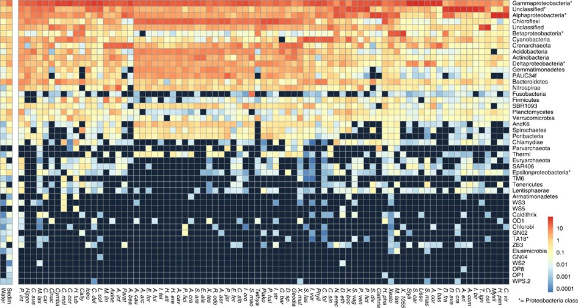
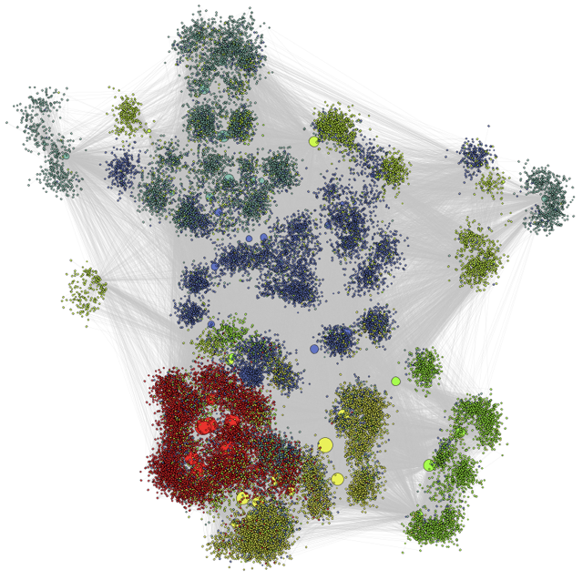
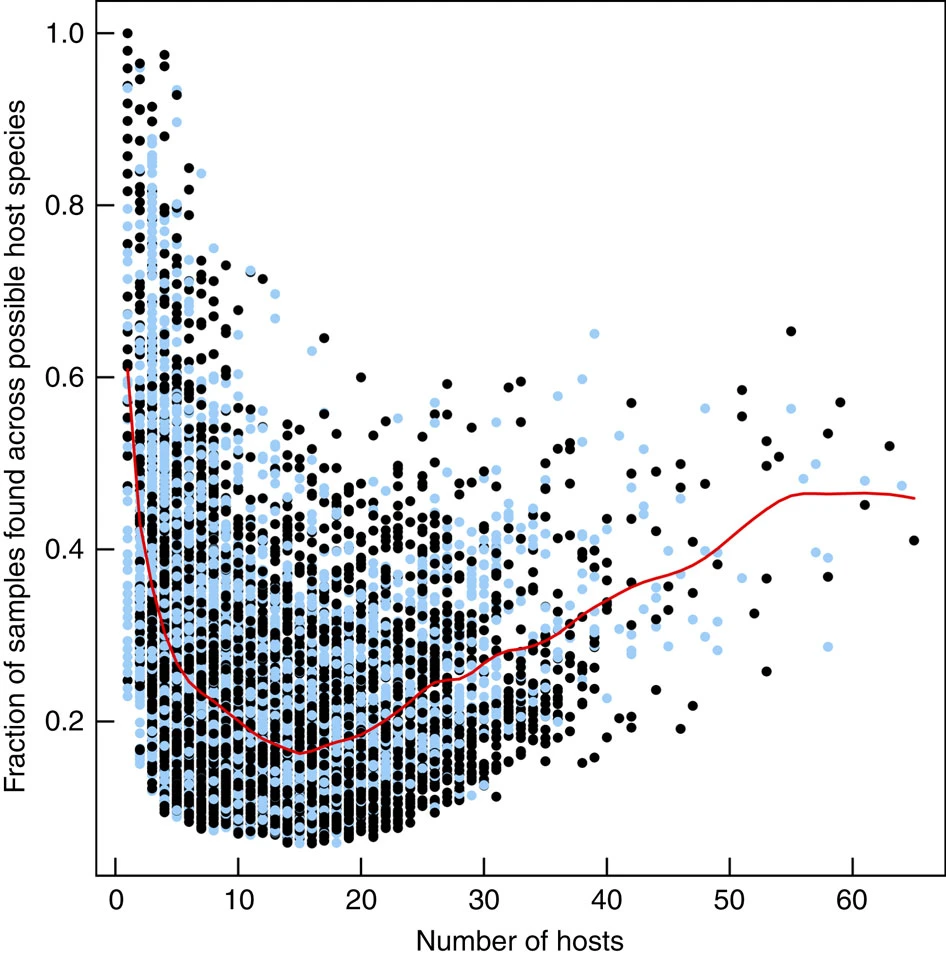
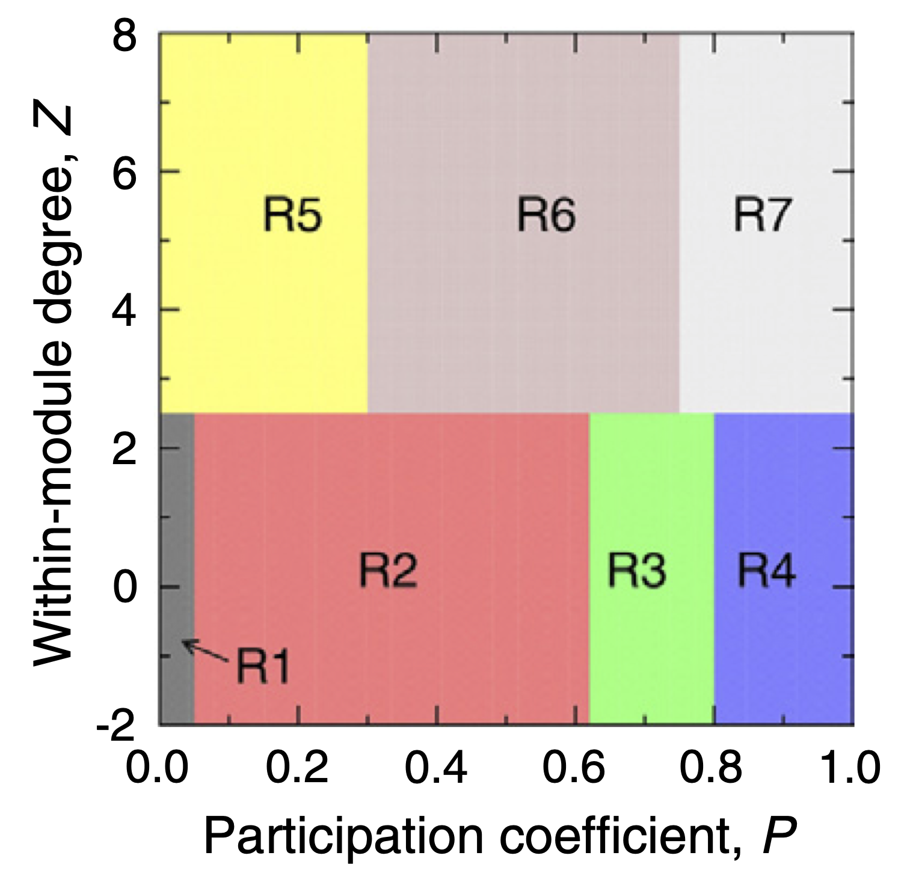
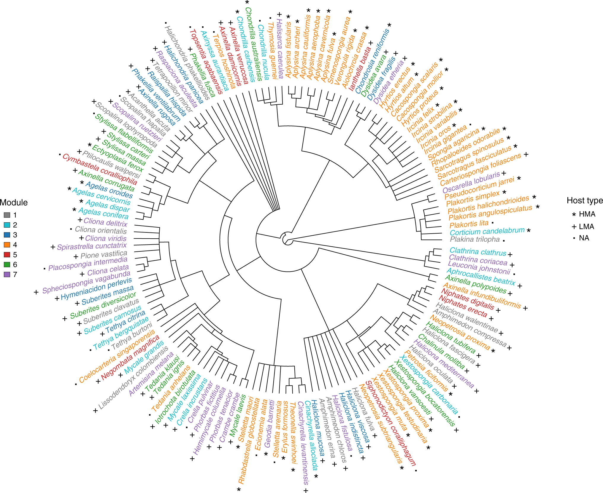
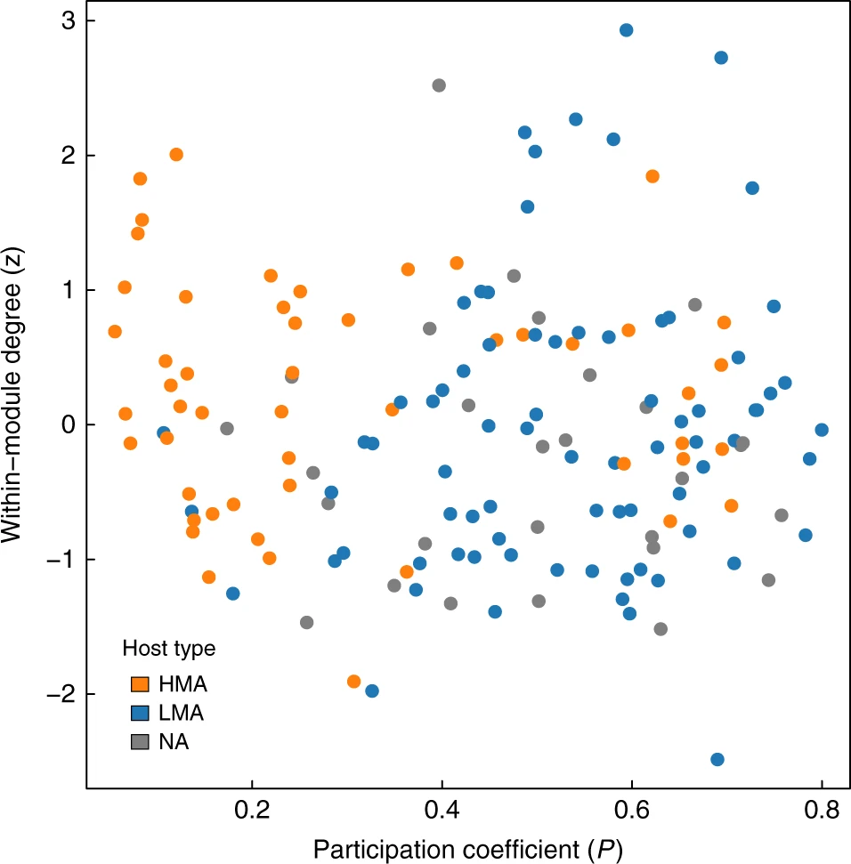
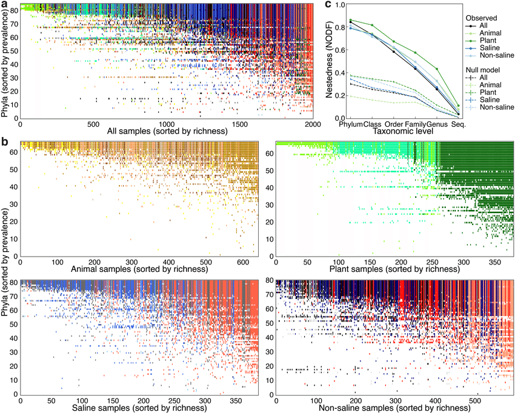
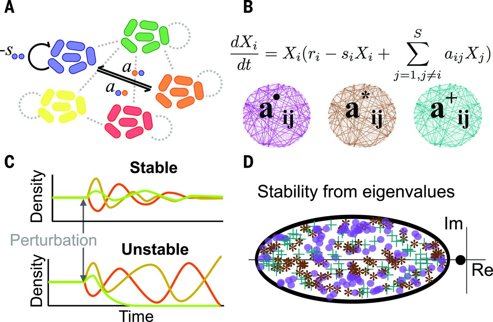
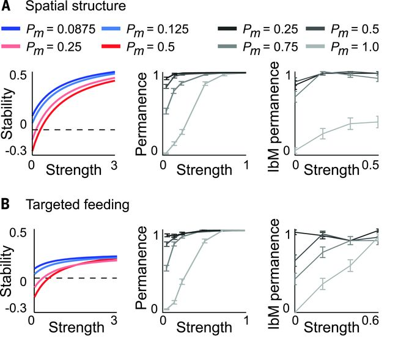

Microbes are widespread across the globe, occupying a myriad of ecological niches and found in environments as diverse as deep sea vents, to soils and water, to inside the mammalian (including human) gut. **Microbes are not only responsible for a large portion of many biogeochemical reactions that have enabled life as we know it, including the global carbon cycle. They also have directly allowed the existence of multicellular organisms*** such as plants and animals by creating intimate associations with them that allow them to perform a suite of metabolic functions without which these multicellular organisms wouldn't be possible.

## Free-living bacterial communities

Microorganisms are ubiquitous across the world, having colonised virtually all environments on Earth. Free-living bacterial communities in the ocean and the soil play key roles in biogeochemical processes including carbon and nutrient cycling. Given their central importance for life on Earth, they have become a central focus of ecological studies aimed at better understanding their composition, structure and function. This would not only allow a better mechanistic understanding of the assembly mechanisms behind their emergence, but also to be in a better position to predict their potential responses to global anthropogenic changes.

{width="500px" style="float:right; padding-left:10px"} 

**Tools available from classical community ecology are commonly applied to microbial ecology** datasets to quantify patterns of diversity across scales. Measures of $\alpha$, $\beta$, and $\gamma$ diversity, as well as community ordination techniques are routinely used to characterise biodiversity and describe differences across communities found on different locations. These patterns are also commonly related to different environmental variables of interest using a suite of statistical methods.

 <strong> Figure taken from Sunagawa et al. (2015) </strong> 

Measures of $\alpha$ and $\gamma$ diversity quantify diversity (often in terms of species richnes, i.e. number of species) at local and regional scales respectively. $\beta$ diversity on the other hand is a measure of change or dissimilarity between local communities, commonly used in community ecology to quantify the turnover or replacement of species across local patches. The most commonly used measure to quantify $\beta$ diversity in microbial ecology is the Bray-Curtis dissimilarity index, a statistic used to quantify the compositional difference between communities based on the species abundances (i.e. counts) at each community. For comparing two communities $i$ and $j$, it is defined thus:

$$
BC_{ij} = 1 - \frac{2C_{ij}}{S_i + S_j}
$$
where $C_{ij}$ is the sum of the lesser values for only those species that are found in both sites, and $S_i$ and $S_j$ are the total number of individuals (or counts) found at sites $i$ and $j$ respectively.

The application of these tools to microbial communities in marine environments has revealed that communities found in different oceans across the globe are substantially different from one another (challenging the hypotheses that the ocean is a well mixed environment), and these differences seem to be driven by ocean temperatures. Additionally, different environmental factors seem to play a role in determining the taxonomic and gene functional composition of these communities.

## Host-associated bacterial communities

Life on Earth as we know it wouldn't be possible without microbes. Multicellular organisms depend fundamentally on the intimate relationships they have developed with microbial communities for survival and health. This has resulted in [our bodies containing about 1.3 as many bacterial as human cells](https://journals.plos.org/plosbiology/article?id=10.1371/journal.pbio.1002533), with the corresponding metabolic function potential provided by these added gene pool. 

Recent advances in gene sequencing technologies have made possible to characterise the sheer diversity of microbial communities that live in association with their multicellular hosts. In the human microbiome community analysis reveals that $\alpha$ diversity varies greatly amongst niches (i.e. body parts), whereas $\beta$ diversity across the same sites in different individuals is more or less constant. Differences in species richness about body parts are reinforced by the differences found on community composition (using principal component analysis) acorss sites. This suggest that the human microbiome is more or less consisten across individuals but there are great variations across different niches associated to different parts of the human body. This makes intuitive sense as we would expect different 'ecosystem fucntions' to be relevant in different parts of the body.

{width="700px"}

**The organisation of the Human Microbiome**. **(a)** Alpha diversity within subjects by body habitat, grouped by area. **(b)** Bray–Curtis beta diversity among subjects by body habitat. **(c)** Principal coordinates plot showing variation among samples demonstrates that primary clustering is by body area, with the oral, gastrointestinal, skin and urogenital habitats separate; the nares habitat bridges oral and skin habitats. **(d)** Repeated samples from the same subject (blue) are more similar than microbiomes from different subjects (red). Technical replicates (grey) are in turn more similar; these patterns are consistent for all body habitats and for both phylogenetic and metabolic community composition. ***Figure and caption extracted from The Human Microbiome Project Consortium (2012)***.

A similar pattern to that observed in the human microbiome across niches distributed across the human body are observed across species in different genera of multicellular organisms. Bacterial communtiies found across species are different across host species, with explicit links to the functional capabilities of these communities (e.g. Lurgi et al. 2019). When studying these associations, microbial ecologists look not only at the differences between community composition (as done for the marine and human microbiome communities above) but also at the differences in relative abundances of different taxonomic groups across different microbiomes.

{width="700px"}

**Taxonomic profile of microbial communities in marine sponges.** Average phylum-level taxonomic profile of microbial symbiont communities in 81 different sponge species, seawater and marine sediments. Colour scale shows relative abundance in percentage within each host species. ***Figure and caption extracted from Thomas et al. (2016).***

This taxonomical compositional representation, jointly with knowledge on the potential functional capabilities of different microbial phyla, provides clues on the metabolic needs of different host species and their differences. This can in turn be related to ecosystem level thinking about different environmental niches occupied by different host species.

### Beyond classical community analyses: The network approach

{width="300px" style="float:left; padding-right:10px"}

Classical community analyses like those illustrated above on the microbiome can be complemented with more network oriented approaches to unveil further organisational patterns. 

To do this, network representations of the microbiome are required. One approach is to create a bipartite network of the network of hosts and the microbes found within them. In this case the network does not necessarily represent an ecological interaction but it nonetheless represents the patterns of occurrence of microbial taxa across host species.

Looking at the structure of this host-microbiome network can reveal patterns of, for example, microbial persistence across host species. 

{width="400px" style="float:right; padding-left:10px"} 

In marine sponges, this analysis has revealed that **the marine sponge microbiome is made up of three kind of microbes. 1.- A set of very specialised microbes that are found only a handful of hosts but consistently within them (as measured by the fraction of samples on their hosts in which they have been found). 2.- A group of 'transient' microbes that are found in an intermediate number of hosts but not very frequently. And 3.- another set of very generalist microbes (i.e. found in many different host species), which are again found relatively consistent across them**. This suggests that the composition of the microbiome is made up of very specialised and very generalist species with a set of microbes that come and go on different host species, probably linked to exogenous stochastic factors.

Certain system-level network properties can provide insight into the internal organisation of the microbiome can help us better understand how microbial communities have self-organised across host species (modularity); and how likely it is that microbial species found within more specialised hosts are subsets of those found in generalist hosts, thus hinting at a core microbioem that is conserved across species (nestedness).

### Modularity
Modularity is a way of quantifying the extent to which a network is organised into subcommunities within which their nodes are more connected amongst themselves than to the rest of the network. It can be quantified using the formula:

$$
M = \sum_{s=1}^{N_M} \left[ \frac{l_s}{L} - \left( \frac{d_s}{2L} \right)^2 \right]
$$

where $N_M$ is the number of modules, $L$ is the number of links in the network, $l_s$ is the number of links between nodes in module $s$, and $d_s$ is the sum of the degrees in module $s$. Partitions of nodes into 'modules' that yield high scores for $M$ ensure as many within-module links and as few between-module links as possible. Finding partitions that improve the value of $M$ is a hard optimisation problem, and different algorithms have been proposed in the literature to tackle this. An implementation by Guimerà and Nunes Amaral (2005) using simulated annealing yields robust results for this partitioning process. They also define two futher metrics associated with the calculation of modularity that can be useful to understand the role of each nodes in the network. These are the within-module degree and the participation coefficient. These measurements provide node-level information on the connectivity profile at the module and network levels respectively. They are defined thus:

{width="300px" style="float:right; padding-left:10px"}

$$
z_i = \frac{k_i - \bar{k}_{s_i}}{\sigma_{k_{s_i}}}
$$
where $z_i$ is the within-module degree of node $i$, $k_i$ is the number of links to other nodes in its module $s_i$, $k_{s_i}$ is the average degree of all nodes in $s_i$ and $\sigma_{k_{s_i}}$ is the standard deviation of the degree of the nodes within $s_i$.

Participation coefficient, on the other hand, is defined as:

$$
P_i = 1 - \sum_{s=1}^{N_M} \left( \frac{k_{is}}{k_i} \right)^2
$$
where $k_{is}$ is the number of links of node $i$ to nodes in module $s$ and $k_i$ is the total degree of node $i$.

The P-Z space can be classified into 7 roles that nodes can assume in a network, as proposed by Guimerà and Nunes Amaral (2005), which allow us to characterise nodes according to different profiles from ultra-peripheral (nodes that are only connected within their modules) to kinless hubs (nodes that are very connected to all modules in the network).

**Modularity analysis performed over the global sponge microbiome network has allowed to identify groups of host species that harbour similar bacterial communities**, along with the microbial taxa that form these communities. Complementing this analysis with the phylogenetic background of host species allowed us to unveil the evolutionary drivers of these complex symbiotic associations.

{width="500px"}

**Sponge phylogeny is associated with modularity in the global sponge-core microbiome network.** Sponge species belonging to the same module identified over the sponge core–microbiome network display the same colour. Stars, crosses and filled squares refer to sponge type according to whether they are high- or low-microbial abundance species (HMA and LMA respectively). NA = no information for host type is available. ***Figure and caption extracted from Lurgi et al. (2019).***

{width="300px" style="float:right; padding-left:10px"}

Additionally, analysis of the structural roles of host species in the host-microbiome network, revealed fundamental differences in the organisation of High vs Low Microbial Abundance species. **Sponge species that harbour higher densities of microbes tend to be more connected within their modules, whereas host species with low microbial densities are well connected across the network**. These suggests that microbial communities in HMA sponges are more species- or group-specific, while microbes found LMA sponges are more ubiquitous, probably because of being more opportunistic and capable of dispersing through the water column and colonising different species.

### Nestedness

The observation that microbial communities in some host species are more similar between groups of species, while other communities seem to be composed of more ubiquitous microbes suggests a pattern of microbial presence across hosts in which less microbially-rich hosts might harbour bacterial communities that are subsets of more microbially diverse hosts. One way of quantifying this potential pattern is by using a measure of nestedness. Nestedness allows us to quantify the extent to which the species composition (or composition interaction partners if thinking of a plant animal interaction network) of  less speciose communities (or interacting partners of specialist species in a network) are proper subsets of more diverse communities (or of the set of interacting partners of generalist species if thinking about a bipartite interaction network). 
This network property can be quantified using the Nestedness metric based on Overlap and Decreasing Fill proposed by Almeida-Neto et al. (2008):

$$
NODF = \frac{\sum N_{paired}}{(\frac{n(n-1)}{2})+(\frac{m(m-1)}{2})}
$$

where $N_{paired}$ is a score that quantifies the overlap between communities (or diets) of contiguous rows and columns in a community matrix (or incidence matrix for bipartite networks) and $n$ and $m$ are the number of rows and columns in the matrix respectively.

Using nestedness analysis on the microbiome can allow us to unveil patterns in the way different taxonomic groups of species are organised across different environments and host species. This approach has revealed that across different microbiomes globally, species composition in relatively species poor communities is a subset of the composition of more diverse ones. Thus, microbiomes across environments seem to increase in complexity starting from a core community of ubiquitously found taxa, building up to new species that continue to aggregate in into larger assemblages that contain the same species found in smaller ones, possibly due to the availability of further ecological niches that new taxa are able to colonise. Communities found in different environments add new species depending on the availability ecological / functional niches but conserving a set of core taxa, possibly generalist taxa that are capble of surviving under different conditions.

{width="700px"}

**Nestedness of community composition in microbiomes across environments and multicellular host species.** **(a)** Presence–absence of phyla across samples, with phyla (rows) sorted by prevalence and samples (columns) sorted by richness. Shown is a subset of the EMP consisting of n=2,000 biologically independent samples with even representation across environments and studies. With increasing sample richness (left to right), phyla tended to be gained but not lost. **(b)** As in **a** but separated into non-saline, saline, animal, and plant environments. **(c)** Nestedness as a function of taxonomic level, from phylum to tag sequence, across all samples and within environment types. Also shown are median null model NODF scores (± s.d.). NODF measures the average fraction of taxa from less diverse communities that occur in more diverse communities. All environments at all taxonomic levels were more nested than expected randomly, with nestedness higher at higher taxonomic levels (for example, phyla). ***Figure and caption from Thompson et al. (2017).***

## Modelling the Microbiome

{width="300px" style="float:right; padding-left:10px"}

Microbial communities within multicellular hosts are thought to form complex networks of ecological interactions. They are amongst the most complex ecological communities found in nature. It is thus an important challenge to determine the strategies they might use to maintain stability and persistence within their hosts. Modelling approaches like the Lotka-Volterra framework that we explored in [section 3](lesson-4.html) can help us elucidate these mechanisms.

Using a generalised Lotka-Volterra model for many species, Coyte et al. (2015) explored different mechanisms by which hosts may control the ecological interactions between microbial taxa within the microbiome. These mechanisms, targeted at reducing positive feedbacks between cooperative species (e.g. supplementary / targeted feeding by the host) and decreasing the strength of interactions (e.g. via spatial structuring) were shown to increase the stability of the microbiome.

{width="300px" style="float:left; padding-right:10px"}
***Host strategies to promote ecological stability.*** **(A)** Spatial structure promotes ecological stability in linear stability analysis (LAS) (left), permanence analysis (PA) (middle), and an individual-based model (IbM) (right). **(B)** Targeted feeding. Host-supplied nutrients that weaken cooperative interactions promote ecological stability. We observed an exception for which targeted feeding may destabilize more competitive communities in the IbM (Pm = 0.25), but the effect is weak. ***Figure and caption taken from Coyte et al. (2015).***

 
 

## References

Almeida-Neto M, Guimaraes P, Guimaraes PR, Loyola RD & Ulrich W (2008) A consistent metric for nestedness analysis in ecological systems: reconciling concept and measurement. ***Oikos***, 117, 1227-1239.

Coyte KZ, Schluter J & Foster KR (2015) The ecology of the microbiome: Networks, competition, and stability. ***Science***, 350:6261, 663-666. https://doi.org/10.1126/science.aad2602

Guimerà R, Amaral LA. Cartography of complex networks: Modules and universal roles. ***Journal of Statistical Mechanics***, P02001, 1-13. https://doi.org/10.1088/1742-5468/2005/02/P02001

Lurgi M, Thomas T, Wemheuer B, Webster NS & Montoya JM (2019) Modularity and predicted functions of the global sponge-microbiome network. ***Nature Communications***, 10, 992. https://doi.org/10.1038/s41467-019-08925-4

Sunagawa S et al. (2015) Structure and function of the global ocean microbiome. ***Science***, 348:6237. https://doi.org/10.1126/science.1261359

The Human Microbiome Project Consortium. (2012) Structure, function and diversity of the healthy human microbiome. ***Nature***, 486, 207–214. https://doi.org/10.1038/nature11234

Thomas T, Moitinho-Silva L, Lurgi M et al. (2016) Diversity, structure and convergent evolution of the global sponge microbiome. ***Nature Communications*** 7, 11870. https://doi.org/10.1038/ncomms11870

Thompson, L., Sanders, J., McDonald, D. et al. (2017) A communal catalogue reveals Earth’s multiscale microbial diversity. ***Nature***, 551, 457–463. https://doi.org/10.1038/nature24621

## [Back to Start](lesson-1.html){.continue-link}