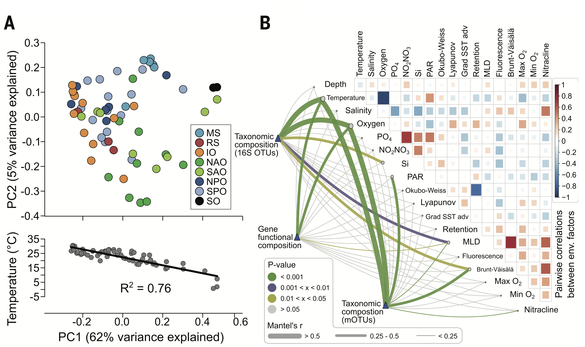

Microbes are widespread across the globe, occupying a myriad of ecological niches and found in environments as diverse as deep sea vents, to soils and water, to inside the mammalian (including human) gut. Microbes are not only responsible for a large portion of many biogeochemical reactions that have enabled life as we know it, including the global carbon cycle. They also have directly allowed the existence of multicellular organisms such as plants and animals by creating intimate associations with them that allow them to perform a suite of metabolic functions without which these multicellular organisms wouldn't be possible.

## Free-living bacterial communities

{width="500px" style="float:right; padding-left:10px"}

Microorganisms are ubiquitous across the world and different environments. Free-living bacterial communities in the ocean and the soil play key roles in biogeochemical processes including carbon and nutrient cycling. Given their central importance for life on Earth, they have become a central focus of ecological studies aimed at better understanding their composition, structure and function. This would not only allow a better mechanistic understanding of the assembly mechanisms behind their emergence, but also to be in a better position to predict their potential responses to global anthropogenic changes.

## Host-associated bacterial communities

{width="700px" style="float:left; padding-right:10px"}

## References

Lurgi M, Thomas T, Wemheuer B, Webster NS & Montoya JM (2019) Modularity and predicted functions of the global sponge-microbiome network. ***Nature Communications***, 10, 992. https://doi.org/10.1038/s41467-019-08925-4

Sunagawa S et al. (2015) Structure and function of the global ocean microbiome. ***Science***, 348:6237. https://doi.org/10.1126/science.1261359

The Human Microbiome Project Consortium. (2012) Structure, function and diversity of the healthy human microbiome. ***Nature***, 486, 207–214. https://doi.org/10.1038/nature11234

Thomas T, Moitinho-Silva L, Lurgi M et al. Diversity, structure and convergent evolution of the global sponge microbiome. ***Nature Communications*** 7, 11870. https://doi.org/10.1038/ncomms11870

## [Back to Start](lesson-1.html){.continue-link}